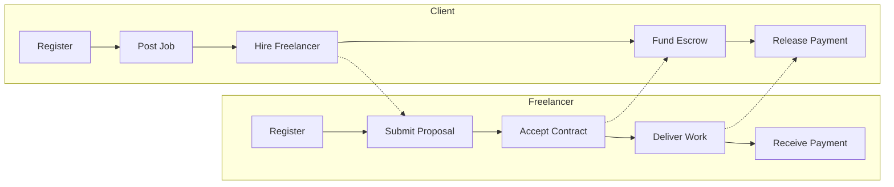

# Product Scope & User Flows — Hive Freelance Marketplace

## 1. Project Overview

The Freelance Marketplace Platform is a web-based application that connects clients with freelancers in a secure and transparent environment. Similar to Upwork, the platform enables clients to post jobs, freelancers to submit proposals, and both parties to collaborate through contracts and milestone-based workflows.

---

## 2. Project Objectives

- Connect clients with skilled freelancers.

---

## 3. User Roles & Permissions

| Feature | Client | Freelancer | Admin |
|---------|--------|------------|-------|
| Register / Login | ✓ | ✓ | ✓ |
| Manage Profile | ✓ | ✓ | ✓ |
| Browse Jobs | ✓ | ✓ | ✓ |
| Post Jobs | ✓ | ✗ | ✓ |
| Edit / Delete Jobs | Own | ✗ | ✓ |
| Submit Proposals | ✗ | ✓ | ✓ |
| View Proposals | ✓ | Own | ✓ |
| Hire Freelancer | ✓ | ✗ | ✓ |
| Accept Contract | ✗ | ✓ | ✓ |
| Messaging | ✓ | ✓ | ✓ |
| Manage Milestones | ✓ | ✓ | ✓ |
| Fund Hive Escrow | ✓ | ✗ | ✓ |
| Deliver Work | ✗ | ✓ | ✓ |
| Release Payment | ✓ | ✗ | ✓ |
| Leave Reviews | ✓ | ✓ | ✓ |
| Receive Reviews | ✓ | ✓ | ✓ |
| Manage Users | ✗ | ✗ | ✓ |
| Manage Contracts | ✗ | ✗ | ✓ |
| Moderate Platform | ✗ | ✗ | ✓ |

**Legend:** ✓ = allowed · ✗ = not allowed · **Own** = allowed for own resources only

---

## 4. Core Features

- Traditional authentication and profile management
- Job posting and management
- Job search and filtering
- Proposal submission and management
- Automatic contract creation
- Milestone management
- Private messaging
- In-app and email notifications
- Hive wallet integration and escrow payments
- Ratings and reviews
- Admin dashboard

---

## 5. MVP Scope

- Authentication
- Profiles
- Jobs
- Search
- Proposals
- Contracts
- Milestones
- Messaging
- Notifications
- Hive Escrow
- Reviews
- Admin dashboard

---

## 6. Out of Scope (Version 1)

- AI features
- Video interviews
- Mobile app
- Team / Agency accounts
- Skill tests
- KYC
- Subscriptions
- Analytics
- Multiple cryptocurrencies
- DAO governance
- NFT certificates
- Automated dispute resolution

---

## 7. User Stories

### Client

- As a client, I want to register and hire freelancers.
- As a client, I want to post jobs.
- As a client, I want to review proposals.
- As a client, I want to fund Hive escrow.
- As a client, I want to release milestone payments.
- As a client, I want to review freelancers.

### Freelancer

- As a freelancer, I want to create a profile.
- As a freelancer, I want to browse jobs.
- As a freelancer, I want to submit proposals.
- As a freelancer, I want to accept contracts.
- As a freelancer, I want to deliver work.
- As a freelancer, I want to receive escrow payments.
- As a freelancer, I want to review clients.

### Admin

- As an admin, I want to manage users.
- As an admin, I want to moderate jobs.
- As an admin, I want to monitor contracts and payments.
- As an admin, I want to manage reviews and categories.

---

## 8. Primary User Journeys

### Client Journey

```
Register → Create Profile → Post Job → Receive Proposals → Hire Freelancer
→ Contract Created → Create Milestones → Deposit Hive Escrow → Review Work
→ Release Payment → Leave Reviews
```

### Freelancer Journey

```
Register → Create Profile → Browse Jobs → Submit Proposal → Proposal Accepted
→ Contract Created → Accept Contract → Complete Milestones → Submit Deliverables
→ Receive Payment → Leave Review
```

### Journey Overview



---

## 9. Functional Requirements

- Authentication
- Profiles
- Jobs
- Proposals
- Contracts
- Messaging
- Hive escrow payments
- Reviews
- Administration

---

## 10. Non-Functional Requirements

- Responsive UI
- Secure authentication
- Role-based authorization
- Reliable Hive integration
- Scalable architecture
- Data integrity
- Maintainable code

---

## 11. Prioritized Feature Backlog (MoSCoW)

| Priority | Features |
|----------|----------|
| **Must Have** | Authentication, Profiles, Jobs, Search, Proposals, Contracts, Milestones, Messaging, Notifications, Hive Escrow, Reviews, Admin Panel |
| **Should Have** | Advanced profile customization, saved searches, richer notifications |
| **Could Have** | Portfolio endorsements, blockchain reputation enhancements, reporting |
| **Won't Have** | AI, mobile app, agencies, subscriptions, DAO, NFTs, multiple cryptocurrencies, automated disputes |
