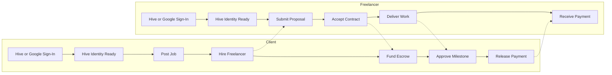

# Product Scope & User Flows — Hive Freelance Marketplace

## 1. Project Overview

The Freelance Marketplace Platform is a web-based application that connects clients with freelancers in a secure and transparent environment. Similar to Upwork, the platform enables clients to post jobs, freelancers to submit proposals, and both parties to collaborate through contracts and milestone-based workflows.

---

## 2. Project Objectives

- Connect clients with skilled freelancers in a secure marketplace built on Hive identity and payments.
- Deliver trust-minimized milestone escrow using Hive assets, with HBD as the default payment rail for price stability.
- Build transparent, portable reputation around Hive-native user identities and on-platform work history.
- Reduce marketplace friction with lower platform overhead and simpler payment settlement than traditional freelance platforms.
- Support fast user onboarding by auto-provisioning Hive accounts, mapping optional Google sign-in to Hive identities, and delegating initial Resource Credits for immediate usability. The detailed onboarding mechanism is defined in the System Architecture document.

---

## 3. User Roles & Permissions

| Feature | Client | Freelancer | Admin |
|---------|--------|------------|-------|
| Register / Login | ✓ | ✓ | ✓ |
| Manage Profile | ✓ | ✓ | ✓ |
| Browse Jobs | ✓ | ✓ | ✓ |
| Post Jobs | ✓ | ✗ | ✓ |
| Edit / Delete Jobs | Own | ✗ | ✓ |
| Submit Proposals | ✗ | ✓ | ✓ |
| View Proposals | ✓ | Own | ✓ |
| Hire Freelancer | ✓ | ✗ | ✓ |
| Accept Contract | ✗ | ✓ | ✓ |
| Messaging | ✓ | ✓ | ✓ |
| Manage Milestones | ✓ | ✓ | ✓ |
| Fund Hive Escrow | ✓ | ✗ | ✓ |
| Deliver Work | ✗ | ✓ | ✓ |
| Release Payment | ✓ | ✗ | ✓ |
| Leave Reviews | ✓ | ✓ | ✓ |
| Receive Reviews | ✓ | ✓ | ✓ |
| Manage Users | ✗ | ✗ | ✓ |
| Manage Contracts | ✗ | ✗ | ✓ |
| Moderate Platform | ✗ | ✗ | ✓ |

**Legend:** ✓ = allowed · ✗ = not allowed · **Own** = allowed for own resources only

---

## 4. Core Features

- Hive-native authentication via Hive Keychain, with optional Google sign-in that provisions a Hive account and maintains a Google-to-Hive identity mapping
- Job posting and management
- Job search and filtering
- Proposal submission and management
- Automatic contract creation
- Milestone management
- Hive wallet integration and escrow payments, with HBD as default and HIVE as an opt-in funding currency
- Escrow release workflow for milestone funding, approval, and payout
- Transparent Hive-based reputation and review history
- Private messaging
- In-app and email notifications
- Ratings and reviews
- Admin dashboard

---

## 5. MVP Scope

- Hive-native authentication
- Profiles
- Jobs
- Search
- Proposals
- Contracts
- Milestones
- Hive Escrow

### Phase 2

- Messaging
- Notifications
- Reviews
- Admin dashboard

---

## 6. Out of Scope (Version 1)

- AI features
- Video interviews
- Mobile app
- Team / Agency accounts
- Skill tests
- KYC
- Subscriptions
- Analytics
- Multiple cryptocurrencies
- DAO governance
- NFT certificates
- Automated dispute resolution

---

## 7. User Stories

### Client

- As a client, I want to sign in with Hive Keychain or Google and receive a usable Hive identity.
- As a client, I want to post jobs.
- As a client, I want to review proposals.
- As a client, I want to fund Hive escrow in HBD by default, with HIVE as an optional job-level choice.
- As a client, I want to release milestone payments.
- As a client, I want to review freelancers.

### Freelancer

- As a freelancer, I want to sign in with Hive Keychain or Google and receive a usable Hive identity.
- As a freelancer, I want to create a profile.
- As a freelancer, I want to browse jobs.
- As a freelancer, I want to submit proposals.
- As a freelancer, I want to accept contracts.
- As a freelancer, I want to deliver work.
- As a freelancer, I want to receive escrow payments.
- As a freelancer, I want to review clients.

### Admin

- As an admin, I want to manage users.
- As an admin, I want to moderate jobs.
- As an admin, I want to monitor contracts and payments.
- As an admin, I want to manage reviews and categories.

---

## 8. Primary User Journeys

### Client Journey

```
Sign In with Hive Keychain or Google → Hive Identity Ready → Create Profile
→ Post Job → Receive Proposals → Hire Freelancer → Contract Created
→ Create Milestones → Fund Escrow (HBD default / HIVE optional) → Review Work
→ Approve Milestone → Release Payment → Leave Reviews
```

### Freelancer Journey

```
Sign In with Hive Keychain or Google → Hive Identity Ready → Create Profile
→ Browse Jobs → Submit Proposal → Proposal Accepted → Contract Created
→ Accept Contract → Complete Milestones → Submit Deliverables
→ Milestone Approved → Receive Payment → Leave Review
```

### Escrow Happy Path

1. Client creates milestones and funds escrow.
2. Escrow defaults to `HBD` to reduce price volatility for longer-running work.
3. Client may opt into `HIVE` at the job level if both parties accept market price exposure.
4. Freelancer submits deliverables for a milestone.
5. Client reviews the work and approves the milestone.
6. Approved funds are released from escrow to the freelancer.

### Escrow Risk Note

Version 1 does not include automated dispute resolution. If a client refuses to release payment after work is delivered, escrowed funds can deadlock until an admin manually reviews the case and releases funds where appropriate.

### Journey Overview



---

## 9. Functional Requirements

- Hive-native authentication with optional Google sign-in and Google-to-Hive identity mapping
- Profiles
- Jobs
- Proposals
- Contracts
- Milestones
- Hive escrow payments with HBD default and HIVE opt-in
- Admin intervention for manual escrow release in v1 deadlock cases

---

## 10. Non-Functional Requirements

- Responsive UI
- Secure authentication
- Role-based authorization
- Reliable Hive integration
- Reliable account provisioning and initial RC delegation for new Hive users
- Scalable architecture
- Data integrity
- Maintainable code

---

## 11. Prioritized Feature Backlog (MoSCoW)

| Priority | Features |
|----------|----------|
| **Must Have** | Hive-native authentication, Google-to-Hive identity mapping, profiles, jobs, search, proposals, contracts, milestones, Hive escrow, HBD default settlement, HIVE opt-in settlement |
| **Should Have** | Messaging, notifications, reviews, admin dashboard, advanced profile customization, saved searches |
| **Could Have** | Portfolio endorsements, blockchain reputation enhancements, reporting |
| **Won't Have** | AI, mobile app, agencies, subscriptions, DAO, NFTs, multiple cryptocurrencies, automated disputes |
