# 02 — Database Schema & Data Model

---

## Overview

Data is divided into two layers:

- **Off-chain (PostgreSQL):** relational data — users, profiles, jobs, proposals, contracts, milestones, payments, reviews. Source of truth for the application layer.
- **On-chain (Hive):** immutable records of critical events — contract creation, milestone approvals, payment releases. The `hive_records` table caches these locally for query performance.

**Out of MVP scope:** disputes, in-app messaging, notifications, skills/categories as structured lookup tables (both use plain text fields for MVP), admin roles, hourly contracts.

---

## Design Principles Applied

- `BIGSERIAL` primary keys throughout
- `TEXT` over `VARCHAR(n)` — identical performance in Postgres
- `created_at` + `updated_at` on every mutable entity table
- `CHECK` constraints enforced at DB level for single-table rules
- Partial indexes on status columns for query performance
- GIN index on JSONB columns

---

## Entity Summary (9 tables)

```
users ──────────────────────────────────────────────────────
  │
  ├── profiles (1:1)
  ├── jobs (as client)
  │     └── proposals (as freelancer)
  │           └── contracts
  │                 ├── milestones
  │                 │     └── payments
  │                 └── reviews
  │
hive_records (cache of on-chain events, referenced by hive_tx_id)
```

---

## Tables

---

### `users`
Core authentication table. Hive username is the identity — no password stored.

| Column | Type | Constraints | Notes |
|--------|------|-------------|-------|
| `id` | BIGSERIAL | PK | |
| `hive_username` | TEXT | UNIQUE NOT NULL | Primary identity, from Hive Keychain |
| `email` | TEXT | UNIQUE | Optional, for off-chain notifications |
| `role` | TEXT | NOT NULL CHECK IN ('client','freelancer','both') | |
| `created_at` | TIMESTAMP | NOT NULL DEFAULT now() | |
| `updated_at` | TIMESTAMP | NOT NULL DEFAULT now() | |

**Indexes:** `hive_username` (unique)

---

### `profiles`
Extended per-user info. One record per user.

| Column | Type | Constraints | Notes |
|--------|------|-------------|-------|
| `id` | BIGSERIAL | PK | |
| `user_id` | BIGINT | FK → users UNIQUE NOT NULL | |
| `bio` | TEXT | | |
| `avatar_url` | TEXT | | |
| `location` | TEXT | | |
| `hourly_rate` | NUMERIC(10,2) | CHECK > 0 | For display only in MVP |
| `skills` | TEXT[] | | Plain text array — no junction table for MVP |
| `created_at` | TIMESTAMP | NOT NULL DEFAULT now() | |
| `updated_at` | TIMESTAMP | NOT NULL DEFAULT now() | |

---

### `jobs`
Posted by clients. Entry point of the workflow.

| Column | Type | Constraints | Notes |
|--------|------|-------------|-------|
| `id` | BIGSERIAL | PK | |
| `client_id` | BIGINT | FK → users NOT NULL | |
| `title` | TEXT | NOT NULL | |
| `description` | TEXT | NOT NULL | |
| `budget` | NUMERIC(10,2) | NOT NULL CHECK > 0 | Single budget field for MVP |
| `category` | TEXT | | Plain text — no lookup table for MVP |
| `skills_required` | TEXT[] | | Plain text array |
| `status` | TEXT | NOT NULL DEFAULT 'open' CHECK IN ('open','in_progress','completed') | |
| `created_at` | TIMESTAMP | NOT NULL DEFAULT now() | |
| `updated_at` | TIMESTAMP | NOT NULL DEFAULT now() | |

**Indexes:** `client_id`, `status`, partial on `status = 'open'`

---

### `proposals`
Submitted by freelancers against open jobs.

| Column | Type | Constraints | Notes |
|--------|------|-------------|-------|
| `id` | BIGSERIAL | PK | |
| `job_id` | BIGINT | FK → jobs NOT NULL | |
| `freelancer_id` | BIGINT | FK → users NOT NULL | |
| `cover_letter` | TEXT | NOT NULL | |
| `bid_amount` | NUMERIC(10,2) | NOT NULL CHECK > 0 | |
| `status` | TEXT | NOT NULL DEFAULT 'pending' CHECK IN ('pending','accepted','rejected') | |
| `hive_tx_id` | TEXT | | Optional on-chain record of proposal |
| `created_at` | TIMESTAMP | NOT NULL DEFAULT now() | |
| `updated_at` | TIMESTAMP | NOT NULL DEFAULT now() | |

**Constraint:** UNIQUE (`job_id`, `freelancer_id`) — one proposal per freelancer per job  
**Indexes:** `job_id`, `freelancer_id`, `status`

---

### `contracts`
Created when a client accepts a proposal. Central entity.

| Column | Type | Constraints | Notes |
|--------|------|-------------|-------|
| `id` | BIGSERIAL | PK | |
| `job_id` | BIGINT | FK → jobs NOT NULL | |
| `proposal_id` | BIGINT | FK → proposals UNIQUE NOT NULL | One contract per proposal |
| `client_id` | BIGINT | FK → users NOT NULL | Denormalized for query performance |
| `freelancer_id` | BIGINT | FK → users NOT NULL | Denormalized for query performance |
| `total_amount` | NUMERIC(10,2) | NOT NULL CHECK > 0 | |
| `status` | TEXT | NOT NULL DEFAULT 'active' CHECK IN ('active','completed','cancelled') | |
| `completed_by_client` | BOOLEAN | NOT NULL DEFAULT false | Set to true when client calls `/complete` |
| `completed_by_freelancer` | BOOLEAN | NOT NULL DEFAULT false | Set to true when freelancer calls `/complete`. Status moves to `completed` once both are true. |
| `hive_tx_id` | TEXT | | On-chain contract creation record |
| `start_date` | TIMESTAMP | | |
| `end_date` | TIMESTAMP | | |
| `created_at` | TIMESTAMP | NOT NULL DEFAULT now() | |
| `updated_at` | TIMESTAMP | NOT NULL DEFAULT now() | |

> **MVP note:** Fixed-price only. `status` goes from `active` → `completed` when both parties call `/complete`. Cancellation only allowed before any milestone is funded.

**Indexes:** `client_id`, `freelancer_id`, `status`

---

### `milestones`
Fundable stages within a contract.

| Column | Type | Constraints | Notes |
|--------|------|-------------|-------|
| `id` | BIGSERIAL | PK | |
| `contract_id` | BIGINT | FK → contracts NOT NULL | |
| `title` | TEXT | NOT NULL | |
| `description` | TEXT | | |
| `amount` | NUMERIC(10,2) | NOT NULL CHECK > 0 | |
| `milestone_order` | INT | NOT NULL | Renamed from `order` — SQL reserved word |
| `status` | TEXT | NOT NULL DEFAULT 'pending' CHECK IN ('pending','funded','submitted','approved','released') | |
| `submitted_at` | TIMESTAMP | | When freelancer marks done |
| `approved_at` | TIMESTAMP | | When client approves |
| `hive_tx_id` | TEXT | | On-chain approval record |
| `created_at` | TIMESTAMP | NOT NULL DEFAULT now() | |
| `updated_at` | TIMESTAMP | NOT NULL DEFAULT now() | |

**Indexes:** `contract_id`, `status`, partial on `status = 'pending'`

---

### `payments`
Tracks escrow movement. Each row maps to one Hive native escrow operation.

| Column | Type | Constraints | Notes |
|--------|------|-------------|-------|
| `id` | BIGSERIAL | PK | |
| `contract_id` | BIGINT | FK → contracts NOT NULL | |
| `milestone_id` | BIGINT | FK → milestones NOT NULL | |
| `amount` | NUMERIC(10,2) | NOT NULL CHECK > 0 | |
| `currency` | TEXT | NOT NULL DEFAULT 'HBD' CHECK IN ('HIVE','HBD') | HBD recommended — dollar-pegged |
| `status` | TEXT | NOT NULL DEFAULT 'pending' CHECK IN ('pending','awaiting_ratification','escrowed','released','refunded') | `refunded` = cooperative cancellation; freelancer broadcast `escrow_release` back to client |
| `escrow_id` | INT | | Hive native escrow ID |
| `hive_tx_id` | TEXT | UNIQUE | Each payment maps to exactly one Hive escrow op |
| `created_at` | TIMESTAMP | NOT NULL DEFAULT now() | |
| `updated_at` | TIMESTAMP | NOT NULL DEFAULT now() | |

**Indexes:** `contract_id`, `milestone_id`, `status`

> **Note on `awaiting_ratification`:** this status sits between the client's `escrow_transfer` broadcast and both the freelancer's and agent's `escrow_approve` being confirmed. It is a real protocol state and must be represented.

---

### `reviews`
Mutual reviews after contract completion. Each contract generates two — client reviews freelancer AND freelancer reviews client.

| Column | Type | Constraints | Notes |
|--------|------|-------------|-------|
| `id` | BIGSERIAL | PK | |
| `contract_id` | BIGINT | FK → contracts NOT NULL | |
| `reviewer_id` | BIGINT | FK → users NOT NULL | |
| `reviewee_id` | BIGINT | FK → users NOT NULL | |
| `rating` | SMALLINT | NOT NULL CHECK BETWEEN 1 AND 5 | |
| `comment` | TEXT | | |
| `hive_tx_id` | TEXT | | On-chain reputation record |
| `created_at` | TIMESTAMP | NOT NULL DEFAULT now() | |

**Constraint:** UNIQUE (`contract_id`, `reviewer_id`) — one review per reviewer per contract

---

### `hive_records`
Local cache of on-chain operations. Written by the blockchain listener service.

| Column | Type | Constraints | Notes |
|--------|------|-------------|-------|
| `id` | BIGSERIAL | PK | |
| `hive_tx_id` | TEXT | UNIQUE NOT NULL | |
| `app_id` | TEXT | NOT NULL | e.g. `hive-freelance-v1` |
| `operation_type` | TEXT | NOT NULL | `custom_json` / `escrow_transfer` / `escrow_approve` / `escrow_release` |
| `from_account` | TEXT | | |
| `to_account` | TEXT | | |
| `escrow_id` | INT | | Present for native escrow operations |
| `payload` | JSONB | | Full operation payload |
| `block_number` | BIGINT | | |
| `block_timestamp` | TIMESTAMP | | Block timestamp from chain |
| `confirmed` | BOOLEAN | NOT NULL DEFAULT false | |
| `created_at` | TIMESTAMP | NOT NULL DEFAULT now() | |
| `updated_at` | TIMESTAMP | NOT NULL DEFAULT now() | Updated when confirmed changes |

**Indexes:** `hive_tx_id` (unique), `operation_type`, `from_account`, GIN on `payload`

---

## What Lives On-Chain vs Off-Chain

| Event | On-Chain Operation | Off-Chain Record |
|-------|--------------------|-----------------|
| Contract creation | `custom_json` | `contracts` row |
| Payment locked | `escrow_transfer` | `payments` (awaiting_ratification) |
| Freelancer ratifies | `escrow_approve` | `payments` → escrowed |
| Milestone approved | `custom_json` | `milestones` (approved) |
| Payment released | `escrow_release` | `payments` (released) |
| Review submitted | `custom_json` | `reviews` row |
| Proposal submitted | `custom_json` (optional) | `proposals` row |

---

## ER Diagram

```mermaid
erDiagram
    users {
        bigserial id PK
        text hive_username UK
        text email UK
        text role
        timestamp created_at
        timestamp updated_at
    }

    profiles {
        bigserial id PK
        bigint user_id FK
        text bio
        text avatar_url
        text location
        numeric hourly_rate
        text skills
        timestamp created_at
        timestamp updated_at
    }

    jobs {
        bigserial id PK
        bigint client_id FK
        text title
        text description
        numeric budget
        text category
        text skills_required
        text status
        timestamp created_at
        timestamp updated_at
    }

    proposals {
        bigserial id PK
        bigint job_id FK
        bigint freelancer_id FK
        text cover_letter
        numeric bid_amount
        text status
        text hive_tx_id
        timestamp created_at
        timestamp updated_at
    }

    contracts {
        bigserial id PK
        bigint job_id FK
        bigint proposal_id FK
        bigint client_id FK
        bigint freelancer_id FK
        numeric total_amount
        text status
        boolean completed_by_client
        boolean completed_by_freelancer
        text hive_tx_id
        timestamp start_date
        timestamp end_date
        timestamp created_at
        timestamp updated_at
    }

    milestones {
        bigserial id PK
        bigint contract_id FK
        text title
        text description
        numeric amount
        int milestone_order
        text status
        timestamp submitted_at
        timestamp approved_at
        text hive_tx_id
        timestamp created_at
        timestamp updated_at
    }

    payments {
        bigserial id PK
        bigint contract_id FK
        bigint milestone_id FK
        numeric amount
        text currency
        text status
        int escrow_id
        text hive_tx_id UK
        timestamp created_at
        timestamp updated_at
    }

    reviews {
        bigserial id PK
        bigint contract_id FK
        bigint reviewer_id FK
        bigint reviewee_id FK
        smallint rating
        text comment
        text hive_tx_id
        timestamp created_at
    }

    hive_records {
        bigserial id PK
        text hive_tx_id UK
        text app_id
        text operation_type
        text from_account
        text to_account
        int escrow_id
        jsonb payload
        bigint block_number
        timestamp block_timestamp
        boolean confirmed
        timestamp created_at
        timestamp updated_at
    }

    users ||--|| profiles : "has"
    users ||--o{ jobs : "posts"
    users ||--o{ proposals : "submits"
    users ||--o{ contracts : "client in"
    users ||--o{ contracts : "freelancer in"
    users ||--o{ reviews : "writes"
    users ||--o{ reviews : "receives"
    jobs ||--o{ proposals : "receives"
    proposals ||--|| contracts : "becomes"
    jobs ||--o{ contracts : "governs"
    contracts ||--o{ milestones : "broken into"
    contracts ||--o{ payments : "tracked by"
    contracts ||--o{ reviews : "generates"
    milestones ||--o{ payments : "funded by"

    %% Soft references via hive_tx_id — text key, not enforced FK
    contracts }o--o| hive_records : "hive_tx_id"
    payments }o--o| hive_records : "hive_tx_id"
    milestones }o--o| hive_records : "hive_tx_id"
    proposals }o--o| hive_records : "hive_tx_id"
    reviews }o--o| hive_records : "hive_tx_id"
```



---

## Key Relationships

| Relationship | Type | Notes |
|-------------|------|-------|
| user → profile | 1:1 | |
| user → jobs | 1:M | as client |
| job → proposals | 1:M | |
| proposal → contract | 1:1 | one accepted proposal = one contract |
| contract → milestones | 1:M | |
| contract → payments | 1:M | |
| contract → reviews | 1:2 | client reviews freelancer + freelancer reviews client |
| payment → hive_records | 1:1 | via `hive_tx_id` (UNIQUE on payments) |