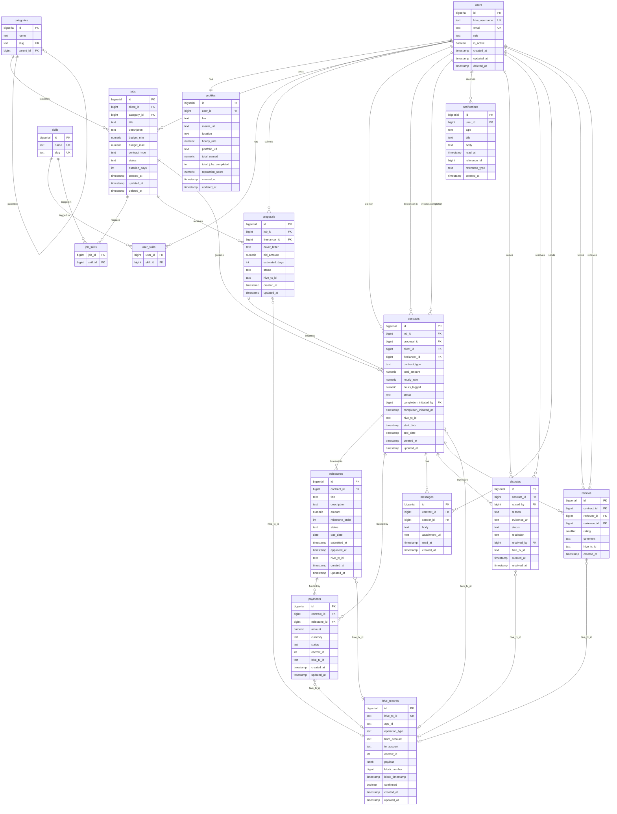

# 02 — Database Schema & Data Model

---

## Overview

The database is PostgreSQL. Data is divided into two layers:

- **Off-chain (Postgres):** all relational data — users, jobs, proposals, contracts, milestones, messages, reviews, notifications. Fast reads, structured queries, the source of truth for the application layer.
- **On-chain (Hive):** immutable records of critical events — contract creation, milestone approvals, payment releases, dispute triggers, reputation scores. The `hive_records` table caches these locally for query performance.

The key architectural insight: Hive has **native escrow operations** at the protocol level (`escrow_transfer`, `escrow_approve`, `escrow_dispute`, `escrow_release`). These are used for payment locking and release — not custom_json. Every payment event in the `payments` table corresponds to a native Hive escrow operation identified by `escrow_id`.

---

## Design Principles Applied

- `BIGSERIAL` primary keys throughout (future-proof beyond 2 billion rows)
- `TEXT` over `VARCHAR(n)` — identical performance in Postgres, no artificial length caps
- `created_at` + `updated_at` on every table — non-negotiable for debugging and auditing
- Soft deletes (`deleted_at`) on `users` and `jobs` — preserves audit trail, never lose contract history
- Skills and categories as normalized lookup tables with junction tables — not arrays — for proper indexing and filtering
- `CHECK` constraints enforced at DB level, not just application level — **with one caveat:** cross-table business rules (e.g. `hourly_rate` only applies when `role = 'freelancer'`, which lives in a different table) cannot be enforced via SQL CHECK and are handled at the application layer. Single-table rules are always enforced at the DB level.
- Example of an intra-table CHECK on `contracts`: `CHECK ((contract_type = 'fixed' AND hourly_rate IS NULL) OR (contract_type = 'hourly' AND hourly_rate IS NOT NULL))` — both columns live in the same row, so this is enforceable at the DB level.
- `ENUM` types for status fields — prevents invalid state at the database layer
- Partial indexes on filtered status columns for query performance
- GIN index on all JSONB columns

---

## Entity Summary

```
users ──────────────────────────────────────────────────────────┐
  │                                                              │
  ├── profiles (1:1)                                             │
  ├── user_skills ──── skills (lookup)                          │
  ├── jobs (as client) ──── job_skills ──── skills              │
  │     └── proposals (as freelancer)                           │
  │           └── contracts                                     │
  │                 ├── milestones                              │
  │                 ├── payments                                │
  │                 ├── messages                               │
  │                 ├── disputes                               │
  │                 └── reviews                               │
  └── notifications                                             │
                                                                │
categories (lookup) ──── jobs ────────────────────────────────┘
hive_records (cache of on-chain events, referenced by tx_id)
```

---

## Tables

---

### `users`
Core authentication table. A user authenticates via Hive Keychain — no password stored. Their `hive_username` IS their identity.

| Column | Type | Constraints | Notes |
|--------|------|-------------|-------|
| `id` | BIGSERIAL | PK | |
| `hive_username` | TEXT | UNIQUE NOT NULL | Primary identity, sourced from Hive Keychain |
| `email` | TEXT | UNIQUE | Optional, for off-chain notifications only |
| `role` | TEXT | NOT NULL CHECK IN ('client','freelancer','both','admin') | A user can hold both roles |
| `is_active` | BOOLEAN | NOT NULL DEFAULT true | |
| `created_at` | TIMESTAMP | NOT NULL DEFAULT now() | |
| `updated_at` | TIMESTAMP | NOT NULL DEFAULT now() | |
| `deleted_at` | TIMESTAMP | | Soft delete — preserves contract history |

**Indexes:** `hive_username` (unique), `role`, partial on `deleted_at IS NULL`

---

### `profiles`
Extended per-user information. One record per user.

| Column | Type | Constraints | Notes |
|--------|------|-------------|-------|
| `id` | BIGSERIAL | PK | |
| `user_id` | BIGINT | FK → users, UNIQUE NOT NULL | |
| `bio` | TEXT | | |
| `avatar_url` | TEXT | | |
| `location` | TEXT | | |
| `hourly_rate` | NUMERIC(10,2) | CHECK > 0 | Freelancers only — cross-table CHECK against users.role not possible in SQL; enforced at application layer |
| `portfolio_url` | TEXT | | |
| `total_earned` | NUMERIC(12,2) | NOT NULL DEFAULT 0 | Denormalized for performance |
| `total_jobs_completed` | INT | NOT NULL DEFAULT 0 | Denormalized for performance |
| `reputation_score` | NUMERIC(4,2) | NOT NULL DEFAULT 0 CHECK BETWEEN 0 AND 5 | Computed from reviews |
| `created_at` | TIMESTAMP | NOT NULL DEFAULT now() | |
| `updated_at` | TIMESTAMP | NOT NULL DEFAULT now() | |

---

### `skills`
Lookup table. Skills are normalized — not stored as arrays in profiles or jobs.

| Column | Type | Constraints |
|--------|------|-------------|
| `id` | BIGSERIAL | PK |
| `name` | TEXT | UNIQUE NOT NULL |
| `slug` | TEXT | UNIQUE NOT NULL |

---

### `user_skills`
Junction: user ↔ skills (many-to-many)

| Column | Type | Constraints |
|--------|------|-------------|
| `user_id` | BIGINT | FK → users |
| `skill_id` | BIGINT | FK → skills |

**Primary Key:** (`user_id`, `skill_id`)

---

### `categories`
Lookup table for job categories. Supports subcategories via self-referential parent.

| Column | Type | Constraints |
|--------|------|-------------|
| `id` | BIGSERIAL | PK |
| `name` | TEXT | NOT NULL |
| `slug` | TEXT | UNIQUE NOT NULL |
| `parent_id` | BIGINT | FK → categories (nullable, for subcategories) |

---

### `jobs`
Posted by clients. A job is the starting point of the entire workflow.

| Column | Type | Constraints | Notes |
|--------|------|-------------|-------|
| `id` | BIGSERIAL | PK | |
| `client_id` | BIGINT | FK → users NOT NULL | |
| `category_id` | BIGINT | FK → categories | |
| `title` | TEXT | NOT NULL | |
| `description` | TEXT | NOT NULL | |
| `budget_min` | NUMERIC(10,2) | CHECK > 0 | |
| `budget_max` | NUMERIC(10,2) | CHECK >= budget_min | |
| `contract_type` | TEXT | NOT NULL CHECK IN ('fixed','hourly') | |
| `status` | TEXT | NOT NULL DEFAULT 'open' CHECK IN ('draft','open','in_progress','completed','cancelled') | |
| `duration_days` | INT | CHECK > 0 | Estimated duration |
| `created_at` | TIMESTAMP | NOT NULL DEFAULT now() | |
| `updated_at` | TIMESTAMP | NOT NULL DEFAULT now() | |
| `deleted_at` | TIMESTAMP | | Soft delete |

**Indexes:** `client_id`, `category_id`, `status`, partial on `status = 'open'` AND `deleted_at IS NULL`

---

### `job_skills`
Junction: job ↔ skills (many-to-many)

| Column | Type | Constraints |
|--------|------|-------------|
| `job_id` | BIGINT | FK → jobs |
| `skill_id` | BIGINT | FK → skills |

**Primary Key:** (`job_id`, `skill_id`)

---

### `proposals`
Submitted by freelancers against open jobs.

| Column | Type | Constraints | Notes |
|--------|------|-------------|-------|
| `id` | BIGSERIAL | PK | |
| `job_id` | BIGINT | FK → jobs NOT NULL | |
| `freelancer_id` | BIGINT | FK → users NOT NULL | |
| `cover_letter` | TEXT | NOT NULL | |
| `bid_amount` | NUMERIC(10,2) | NOT NULL CHECK > 0 | |
| `estimated_days` | INT | CHECK > 0 | |
| `status` | TEXT | NOT NULL DEFAULT 'pending' CHECK IN ('pending','accepted','rejected','withdrawn') | |
| `hive_tx_id` | TEXT | | On-chain record of proposal submission |
| `created_at` | TIMESTAMP | NOT NULL DEFAULT now() | |
| `updated_at` | TIMESTAMP | NOT NULL DEFAULT now() | |

**Indexes:** `job_id`, `freelancer_id`, `status`  
**Constraint:** UNIQUE (`job_id`, `freelancer_id`) — one proposal per freelancer per job

---

### `contracts`
Created when a client accepts a proposal. The central entity of the platform.

| Column | Type | Constraints | Notes |
|--------|------|-------------|-------|
| `id` | BIGSERIAL | PK | |
| `job_id` | BIGINT | FK → jobs NOT NULL | |
| `proposal_id` | BIGINT | FK → proposals UNIQUE NOT NULL | One contract per proposal |
| `client_id` | BIGINT | FK → users NOT NULL | |
| `freelancer_id` | BIGINT | FK → users NOT NULL | |
| `contract_type` | TEXT | NOT NULL CHECK IN ('fixed','hourly') | |
| `total_amount` | NUMERIC(10,2) | NOT NULL CHECK > 0 | |
| `hourly_rate` | NUMERIC(10,2) | CHECK ((contract_type='fixed' AND hourly_rate IS NULL) OR (contract_type='hourly' AND hourly_rate IS NOT NULL)) | NULL for fixed contracts, enforced at DB level |
| `hours_logged` | NUMERIC(8,2) | NOT NULL DEFAULT 0 | For hourly contracts |
| `status` | TEXT | NOT NULL DEFAULT 'active' CHECK IN ('active','completed','disputed','cancelled') | |
| `completion_initiated_by` | BIGINT | FK → users | The first party to call /complete. NULL until initiated. |
| `completion_initiated_at` | TIMESTAMP | | Timestamp of first completion call. NULL until initiated. |
| `hive_tx_id` | TEXT | | On-chain contract creation record |
| `start_date` | TIMESTAMP | | |
| `end_date` | TIMESTAMP | | |
| `created_at` | TIMESTAMP | NOT NULL DEFAULT now() | |
| `updated_at` | TIMESTAMP | NOT NULL DEFAULT now() | |

**Indexes:** `client_id`, `freelancer_id`, `status`, `job_id`

> **Design note — `escrow_id` intentionally omitted from `contracts`:** A fixed-price contract with multiple milestones generates one `escrow_transfer` operation per milestone — multiple escrow instances per contract. An hourly contract has no discrete milestone-level escrows. Storing `escrow_id` on the contract row is ambiguous in both cases. `escrow_id` lives exclusively on `payments`, where each row maps unambiguously to exactly one Hive escrow operation. `contracts.client_id` and `contracts.freelancer_id` are denormalized deliberately — both are derivable via `proposal_id → job_id`, but the query performance benefit justifies the redundancy.

---

### `milestones`
Breakdown of a contract into fundable, releasable stages.

| Column | Type | Constraints | Notes |
|--------|------|-------------|-------|
| `id` | BIGSERIAL | PK | |
| `contract_id` | BIGINT | FK → contracts NOT NULL | |
| `title` | TEXT | NOT NULL | |
| `description` | TEXT | | |
| `amount` | NUMERIC(10,2) | NOT NULL CHECK > 0 | |
| `milestone_order` | INT | NOT NULL | Sequence within the contract — renamed from `order` (SQL reserved word) |
| `status` | TEXT | NOT NULL DEFAULT 'pending' CHECK IN ('pending','funded','submitted','approved','released','disputed') | |
| `due_date` | DATE | | |
| `submitted_at` | TIMESTAMP | | When freelancer marks as done |
| `approved_at` | TIMESTAMP | | When client approves |
| `hive_tx_id` | TEXT | | On-chain approval/release record |
| `created_at` | TIMESTAMP | NOT NULL DEFAULT now() | |
| `updated_at` | TIMESTAMP | NOT NULL DEFAULT now() | |

**Indexes:** `contract_id`, `status`, partial on `status = 'pending'`

---

### `payments`
Tracks escrow movement. Each record maps to a Hive native escrow operation.

| Column | Type | Constraints | Notes |
|--------|------|-------------|-------|
| `id` | BIGSERIAL | PK | |
| `contract_id` | BIGINT | FK → contracts NOT NULL | |
| `milestone_id` | BIGINT | FK → milestones | NULL for full contract payments |
| `amount` | NUMERIC(10,2) | NOT NULL CHECK > 0 | |
| `currency` | TEXT | NOT NULL DEFAULT 'HIVE' CHECK IN ('HIVE','HBD') | |
| `status` | TEXT | NOT NULL DEFAULT 'pending' CHECK IN ('pending','escrowed','released','refunded','disputed') | |
| `escrow_id` | INT | | Hive native escrow ID — links to `escrow_transfer` op |
| `hive_tx_id` | TEXT | UNIQUE | Each payment maps to exactly one Hive escrow op |
| `created_at` | TIMESTAMP | NOT NULL DEFAULT now() | |
| `updated_at` | TIMESTAMP | NOT NULL DEFAULT now() | |

**Note on Hive native escrow:** A `payment` record in escrowed state corresponds to a live `escrow_transfer` operation on Hive, where funds are locked with an `agent` (our platform account) until both parties approve or a dispute is raised. The `escrow_id` is the unique ID assigned by the Hive protocol to that operation.

---

### `disputes`
Raised when a client or freelancer cannot resolve a milestone disagreement.

| Column | Type | Constraints | Notes |
|--------|------|-------------|-------|
| `id` | BIGSERIAL | PK | |
| `contract_id` | BIGINT | FK → contracts NOT NULL | |
| `raised_by` | BIGINT | FK → users NOT NULL | |
| `reason` | TEXT | NOT NULL | |
| `evidence_url` | TEXT | | Link to uploaded evidence |
| `status` | TEXT | NOT NULL DEFAULT 'open' CHECK IN ('open','under_review','resolved','escalated') | |
| `resolution` | TEXT | | Admin decision rationale |
| `resolved_by` | BIGINT | FK → users | Admin or arbitrator |
| `hive_tx_id` | TEXT | | On-chain dispute record (escrow_dispute op) |
| `created_at` | TIMESTAMP | NOT NULL DEFAULT now() | |
| `resolved_at` | TIMESTAMP | | |

**Indexes:** `contract_id`, `status`, partial on `status = 'open'`

---

### `messages`
In-contract communication between client and freelancer.

| Column | Type | Constraints |
|--------|------|-------------|
| `id` | BIGSERIAL | PK |
| `contract_id` | BIGINT | FK → contracts NOT NULL |
| `sender_id` | BIGINT | FK → users NOT NULL |
| `body` | TEXT | NOT NULL |
| `attachment_url` | TEXT | |
| `read_at` | TIMESTAMP | |
| `created_at` | TIMESTAMP | NOT NULL DEFAULT now() |

**Indexes:** `contract_id`, `sender_id`

---

### `reviews`
Mutual reviews after contract completion. Each contract generates two reviews — client reviews freelancer AND freelancer reviews client.

| Column | Type | Constraints | Notes |
|--------|------|-------------|-------|
| `id` | BIGSERIAL | PK | |
| `contract_id` | BIGINT | FK → contracts NOT NULL | |
| `reviewer_id` | BIGINT | FK → users NOT NULL | |
| `reviewee_id` | BIGINT | FK → users NOT NULL | |
| `rating` | SMALLINT | NOT NULL CHECK BETWEEN 1 AND 5 | |
| `comment` | TEXT | | |
| `hive_tx_id` | TEXT | | On-chain reputation record |
| `created_at` | TIMESTAMP | NOT NULL DEFAULT now() | |

**Constraint:** UNIQUE (`contract_id`, `reviewer_id`) — one review per reviewer per contract  
**Indexes:** `reviewee_id` (for reputation lookups), `contract_id`

---

### `notifications`
Off-chain notification events for UI alerts and emails.

| Column | Type | Constraints | Notes |
|--------|------|-------------|-------|
| `id` | BIGSERIAL | PK | |
| `user_id` | BIGINT | FK → users NOT NULL | |
| `type` | TEXT | NOT NULL | e.g. `proposal_received`, `milestone_approved`, `payment_released` |
| `title` | TEXT | NOT NULL | |
| `body` | TEXT | | |
| `read_at` | TIMESTAMP | | NULL = unread |
| `reference_id` | BIGINT | | Polymorphic — ID of the related entity |
| `reference_type` | TEXT | | e.g. `contract`, `proposal`, `milestone` |
| `created_at` | TIMESTAMP | NOT NULL DEFAULT now() | |

**Indexes:** `user_id`, partial on `read_at IS NULL`

---

### `hive_records`
Local cache of on-chain operations. Source of truth for anything that happened on Hive, indexed for fast queries. Written by the Node.js blockchain listener service.

| Column | Type | Constraints | Notes |
|--------|------|-------------|-------|
| `id` | BIGSERIAL | PK | |
| `hive_tx_id` | TEXT | UNIQUE NOT NULL | Hive transaction ID |
| `app_id` | TEXT | NOT NULL | e.g. `hive-freelance-v1` — identifies our app's ops |
| `operation_type` | TEXT | NOT NULL | `custom_json` / `escrow_transfer` / `escrow_release` / `escrow_dispute` / `escrow_approve` |
| `from_account` | TEXT | | Hive username of sender |
| `to_account` | TEXT | | Hive username of recipient |
| `escrow_id` | INT | | Present for native escrow operations |
| `payload` | JSONB | | Full operation payload |
| `block_number` | BIGINT | | |
| `block_timestamp` | TIMESTAMP | | Block timestamp from chain |
| `confirmed` | BOOLEAN | NOT NULL DEFAULT false | True once irreversible |
| `created_at` | TIMESTAMP | NOT NULL DEFAULT now() | When we cached it |
| `updated_at` | TIMESTAMP | NOT NULL DEFAULT now() | Updated when confirmed changes |

**Indexes:** `hive_tx_id` (unique), `app_id`, `from_account`, `escrow_id`, GIN on `payload`

---

## What Lives On-Chain vs Off-Chain

| Event | On-Chain Operation | Off-Chain Record |
|-------|--------------------|-----------------|
| Contract creation | `custom_json` | `contracts` row |
| Payment locked | `escrow_transfer` | `payments` (escrowed) |
| Milestone approval | `custom_json` | `milestones` (approved) |
| Payment release | `escrow_release` | `payments` (released) |
| Dispute raised | `escrow_dispute` | `disputes` row |
| Review submitted | `custom_json` | `reviews` row |
| Proposal submitted | `custom_json` (optional) | `proposals` row |
| Messages | Off-chain only | `messages` row |
| Notifications | Off-chain only | `notifications` row |

---

## Key Relationships Summary

| Relationship | Type | Notes |
|-------------|------|-------|
| user → profile | 1:1 | |
| user → skills | M:M | via `user_skills` |
| user → jobs | 1:M | as client |
| job → skills | M:M | via `job_skills` |
| job → proposals | 1:M | |
| proposal → contract | 1:1 | one accepted proposal = one contract |
| contract → milestones | 1:M | |
| contract → payments | 1:M | |
| contract → messages | 1:M | |
| contract → disputes | 1:M | max 1 open at a time |
| contract → reviews | 1:2 | client reviews freelancer + freelancer reviews client |
| payment → hive_records | 1:1 | via `hive_tx_id` (UNIQUE on payments — each payment is one escrow op) |

---

## ER Diagram

> Rendered automatically by GitHub. Open this file on GitHub to see the visual diagram.

