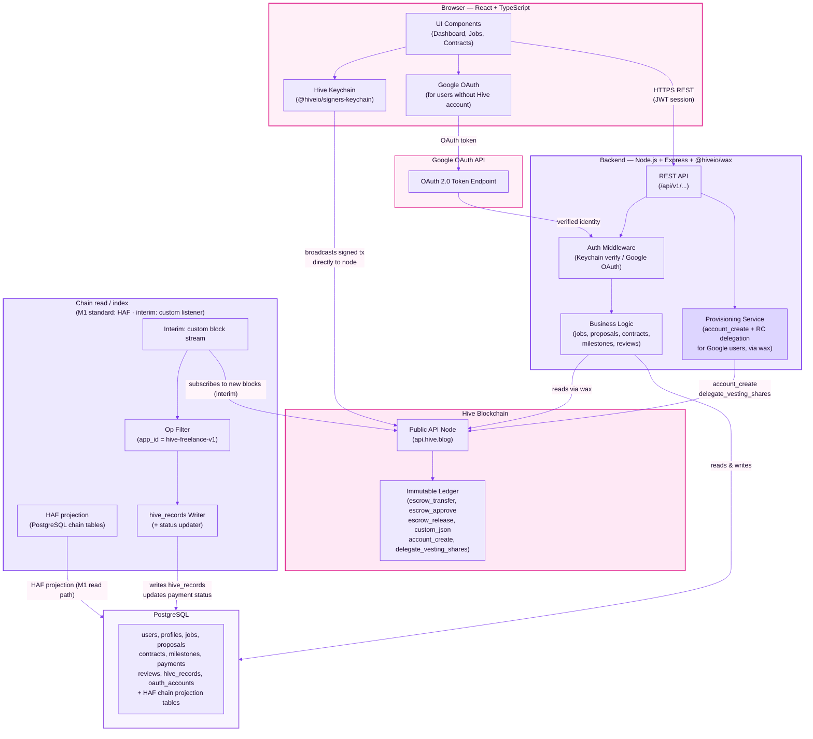
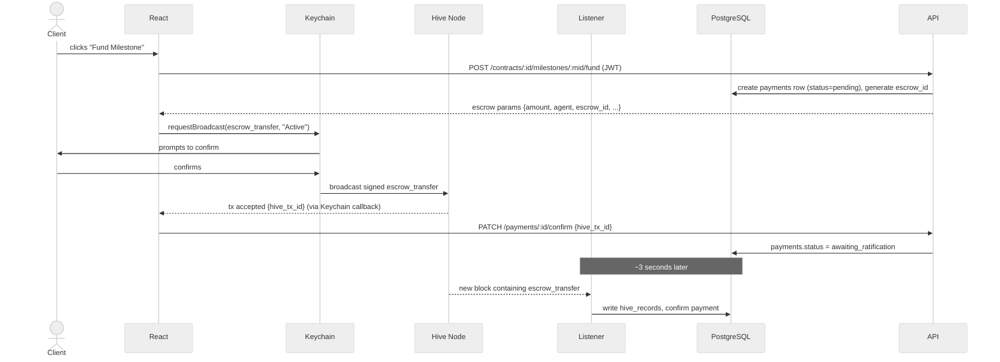
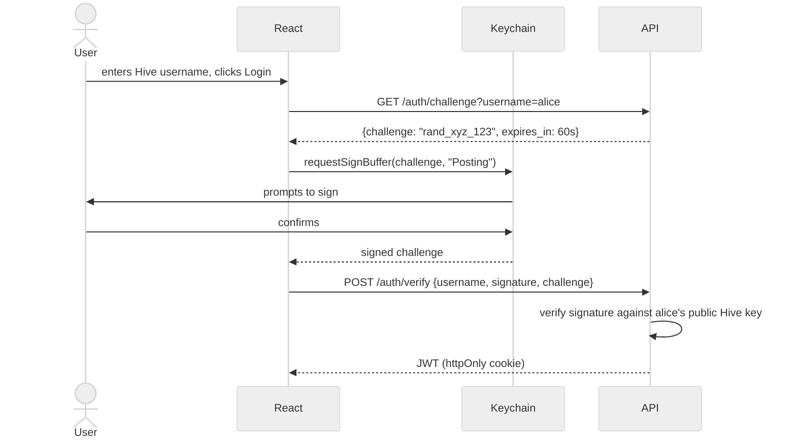

# 03 — High-Level Architecture & API Endpoints

---

## Overview

Four layers, one background sync path, one provisioning service. **Milestone 1 standard:** build/sign with **WAX**; read/index chain data with **HAF**. An interim custom listener may still filter ops into `hive_records` while HAF is wired. The provisioning service creates Hive accounts for Google OAuth users and stubs Resource Credit delegation so new accounts can broadcast later.

---

## System Architecture Diagram

---

## Layer Responsibilities

| Layer | Responsible for | NOT responsible for |
|-------|----------------|---------------------|
| React frontend | UI, routing, Keychain integration, Google OAuth redirect, broadcasting txs | Business logic, DB access |
| Express API | Auth (both paths), validation, business logic, DB reads/writes | Holding user signing keys, broadcasting txs |
| Provisioning service | Creating Hive accounts for Google users, delegating RC, storing custodial keys in KMS | Serving HTTP requests |
| Blockchain listener | Stream blocks, filter ops, write `hive_records`, update payment status | Serving HTTP requests |
| PostgreSQL | Relational data, fast queries, source of truth for app state | On-chain enforcement |
| Hive blockchain | Immutable audit trail, escrow locking/release | Application logic |

---

## Milestone Funding Flow

---

## Auth Flow

---

## Design Notes

**Transaction library:** All server-side transaction building and signing uses `@hiveio/wax` (Greateck standard). Browser-side Keychain signing uses `@hiveio/signers-keychain`. Do not use `@hiveio/dhive`.

**Blockchain listener / HAF:** Greateck standard for **reading/indexing** chain data is **HAF** (PostgreSQL projection of the chain). Milestone 1 foundation acceptance requires the app to read Hive account/records **via HAF**. An interim custom Node.js block listener + `hive_records` may still exist as scaffolding; it is a hand-rolled subset of HAF and must not be treated as the long-term or M1-acceptance read path.

**Google OAuth + account provisioning:** Users without a Hive account log in via Google. The provisioning service creates a Hive account (`account_create` op), delegates Resource Credits (`delegate_vesting_shares`) so the new account can broadcast transactions, and stores the custodial active key in a KMS. The `oauth_accounts` table (see doc 02) maps Google identities to Hive usernames.

**Resource Credits:** Brand-new Hive accounts have ~0 RC and cannot broadcast any transaction. RC delegation by the provisioning service is a hard prerequisite before a Google-provisioned user can perform any on-chain action.

**The agent account:** The platform backend holds the Hive agent account's active key to auto-approve `escrow_approve` during ratification. This key can move all escrowed funds on the platform and is the highest-value secret in the system. It must be stored in a KMS/HSM (not an env var in production), with restricted signing scope, full audit logging on every use, and alerting on any unexpected signing event. The agent account holds zero HIVE balance. See doc 05 for full hardening requirements.

**Why the blockchain listener is a separate service:** The API is request-driven. The listener is event-driven (new blocks every 3s). Mixing them creates lifecycle conflicts. They share the same DB but run independently.

**LIB requirement — never confirm on first-seen:** Only update `payments.status` to `escrowed` or `released` after the containing block reaches the Last Irreversible Block (LIB). A payment seen in a head block could be on a fork and later revert. Track LIB (from `get_dynamic_global_properties` as `last_irreversible_block_num`) and delay status updates until irreversible — or rely on HAF’s irreversibility handling once the read/sync path is HAF-backed.

**Custodial surface — Google user keys:** The KMS holds an active key for every Google-provisioned user, not just the agent. Per-user key isolation (separate KMS key per user, not a shared vault key) is required. Least-authority principle: each user's KMS key should only be authorized to sign for that user's account. Users must be clearly informed in UX/ToS that the platform is custodying their keys. The claim/hand-over path (`/auth/me/claim-account`) provides the exit to self-custody.

---

## API Endpoints

Base URL: `/api/v1`  
Auth: JWT Bearer token on all protected routes (marked 🔒)

---

### Auth

| Method | Endpoint | Auth | Description |
|--------|----------|------|-------------|
| GET | `/auth/challenge` | — | Get sign challenge for a Hive username (Keychain path) |
| POST | `/auth/verify` | — | Verify signed challenge, return JWT |
| GET | `/auth/google` | — | Redirect to Google OAuth consent screen |
| GET | `/auth/google/callback` | — | Google OAuth callback → provision Hive account if new → return JWT |

---

### Users & Profiles

| Method | Endpoint | Auth | Description |
|--------|----------|------|-------------|
| GET | `/users/:username` | — | Get public profile by Hive username |
| PUT | `/users/me/profile` | 🔒 | Update own profile |
| GET | `/users/me/dashboard` | 🔒 | Own active contracts, proposals, reviews |

---

### Jobs

| Method | Endpoint | Auth | Description |
|--------|----------|------|-------------|
| GET | `/jobs` | — | List open jobs (paginated, filterable by category/skills) |
| GET | `/jobs/:id` | — | Get single job + proposal count |
| POST | `/jobs` | 🔒 | Create a job (client only) |
| PUT | `/jobs/:id` | 🔒 | Edit a job (owner only, while open) |
| DELETE | `/jobs/:id` | 🔒 | Delete a job (owner only, while open) |

---

### Proposals

| Method | Endpoint | Auth | Description |
|--------|----------|------|-------------|
| GET | `/jobs/:id/proposals` | 🔒 | List proposals on a job (client only) |
| POST | `/jobs/:id/proposals` | 🔒 | Submit a proposal (freelancer only) |
| DELETE | `/proposals/:id` | 🔒 | Withdraw own proposal (while pending) |
| POST | `/proposals/:id/accept` | 🔒 | Accept proposal → creates contract + returns `custom_json` payload for client to broadcast |
| PATCH | `/proposals/:id/accept/confirm` | 🔒 | Record contract creation `hive_tx_id` |
| POST | `/proposals/:id/reject` | 🔒 | Reject a proposal (client only) |

---

### Contracts

| Method | Endpoint | Auth | Description |
|--------|----------|------|-------------|
| GET | `/contracts` | 🔒 | List own contracts (as client or freelancer) |
| GET | `/contracts/:id` | 🔒 | Contract detail + milestones + payment status |
| POST | `/contracts/:id/complete` | 🔒 | Sets caller's completion flag; status → `completed` once both `completed_by_client` and `completed_by_freelancer` are true |
| POST | `/contracts/:id/cancel` | 🔒 | Only allowed if no milestone has status `funded`, `submitted`, `approved`, or `released` |

---

### Milestones

| Method | Endpoint | Auth | Description |
|--------|----------|------|-------------|
| GET | `/contracts/:id/milestones` | 🔒 | List milestones |
| POST | `/contracts/:id/milestones` | 🔒 | Create milestone (client, while contract active) |
| POST | `/milestones/:id/submit` | 🔒 | Freelancer marks milestone as done |
| POST | `/milestones/:id/approve` | 🔒 | Client approves → returns `custom_json` payload to broadcast |
| PATCH | `/milestones/:id/approve/confirm` | 🔒 | Record approval `hive_tx_id` |

---

### Payments (Escrow)

| Method | Endpoint | Auth | Description |
|--------|----------|------|-------------|
| GET | `/contracts/:id/payments` | 🔒 | List payment records for a contract |
| POST | `/contracts/:id/milestones/:mid/fund` | 🔒 | Creates `payments` row (status=`pending`), generates `escrow_id`, returns escrow params for Keychain |
| PATCH | `/payments/:id/confirm` | 🔒 | Record `escrow_transfer` `hive_tx_id` → status `awaiting_ratification` |
| POST | `/payments/:id/ratify` | 🔒 | Freelancer gets `escrow_approve` payload for Keychain (Active key) |
| PATCH | `/payments/:id/ratify/confirm` | 🔒 | Record freelancer `escrow_approve` hive_tx_id; once agent also approved, listener sets status to `escrowed` |
| POST | `/payments/:id/release` | 🔒 | Client gets `escrow_release` params for Keychain |
| PATCH | `/payments/:id/release/confirm` | 🔒 | Record release `hive_tx_id` → status `released` |
| POST | `/payments/:id/refund` | 🔒 | Freelancer gets `escrow_release`-to-client params (cooperative cancellation with funded milestones) |
| PATCH | `/payments/:id/refund/confirm` | 🔒 | Record refund `hive_tx_id` → status `refunded` |

> **Contract cancellation with funded milestones:** `/cancel` only works before any milestone is funded. If a milestone is already escrowed, the cooperative path is: freelancer broadcasts `escrow_release` back to the client. If the freelancer refuses to cooperate, either party can raise `escrow_dispute` — the platform agent then adjudicates and can release funds to either party via `POST /disputes/:id/resolve`. `escrow_expiration` does NOT auto-refund; it resolves nothing on its own.

---

### Disputes (Admin Resolver)

| Method | Endpoint | Auth | Description |
|--------|----------|------|-------------|
| POST | `/milestones/:id/dispute` | 🔒 | Either party raises `escrow_dispute` via Keychain/KMS → `payments.status = disputed` |
| PATCH | `/milestones/:id/dispute/confirm` | 🔒 | Record `escrow_dispute` `hive_tx_id` |
| POST | `/disputes/:id/resolve` | 🔒 (admin) | Authorized team member triggers agent to broadcast `escrow_release` to client or freelancer. Requires `resolution_direction` + `resolution_notes`. Agent uses KMS-held key — same account named in the original `escrow_transfer`. |

> **Protocol constraint:** The resolver must be the same `agent` account named in the original `escrow_transfer` — a separate admin account cannot be introduced after funding. The platform agent IS the resolver. Admin controls are an authorization layer on top of it, not a separate on-chain actor.

---

### Account Claim (Google-provisioned users)

| Method | Endpoint | Auth | Description |
|--------|----------|------|-------------|
| POST | `/auth/me/claim-account` | 🔒 | User submits their own owner/active/posting/memo public keys → platform broadcasts `account_update2` rotating all keys to user's keys → platform irreversibly wipes custodial copies from KMS. After this the platform cannot sign for this user. |

---

### Reviews

| Method | Endpoint | Auth | Description |
|--------|----------|------|-------------|
| POST | `/contracts/:id/reviews` | 🔒 | Submit review after contract completion |
| GET | `/users/:username/reviews` | — | Get public reviews for a user |