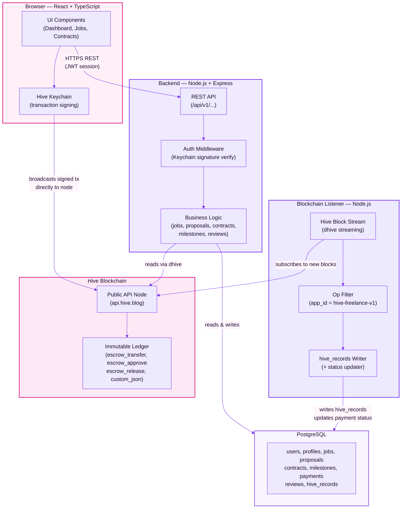
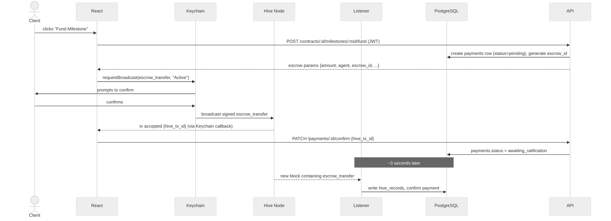
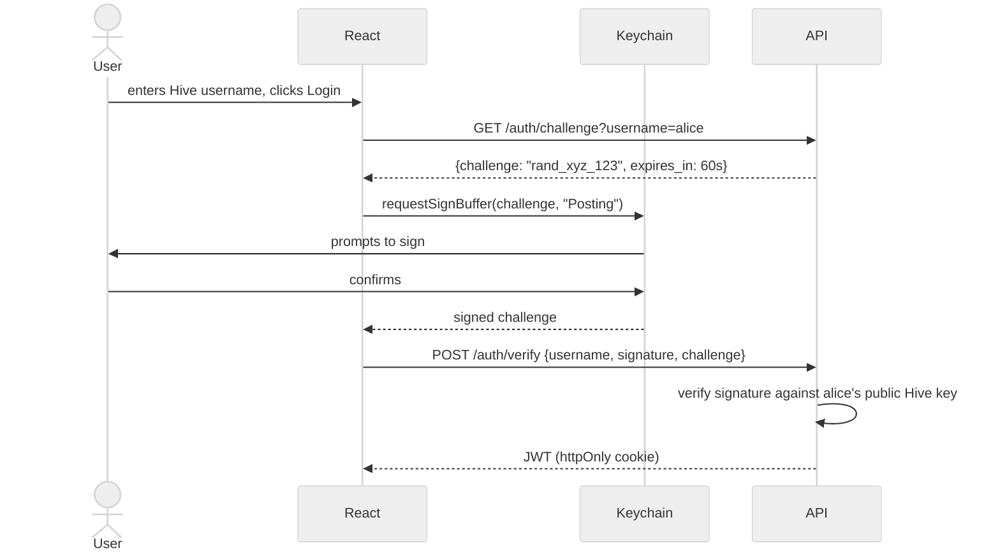

# 03 — High-Level Architecture & API Endpoints

---

## Overview

Four layers, one background service. The blockchain listener — a Node.js process that subscribes to the live Hive chain, filters for this app's operations, and keeps PostgreSQL in sync — is what makes Hive a first-class architectural component rather than an afterthought.

---

## System Architecture Diagram

---

## Layer Responsibilities

| Layer | Responsible for | NOT responsible for |
|-------|----------------|---------------------|
| React frontend | UI, routing, Keychain integration, broadcasting txs | Business logic, DB access |
| Express API | Auth, validation, business logic, DB reads/writes | Holding private keys, broadcasting txs |
| Blockchain listener | Stream blocks, filter ops, write `hive_records`, update payment status | Serving HTTP requests |
| PostgreSQL | Relational data, fast queries, source of truth for app state | On-chain enforcement |
| Hive blockchain | Immutable audit trail, escrow locking/release | Application logic |

---

## Milestone Funding Flow

---

## Auth Flow

---

## Design Notes

**Why the API never broadcasts user transactions:** Holding signing authority would make the backend a high-value target. Keychain keeps private keys in the browser extension.

**Why the blockchain listener is a separate service:** The API is request-driven. The listener is event-driven (reacts to new blocks every 3s). Mixing them creates lifecycle conflicts.

**The agent account:** The platform backend holds the Hive agent account's active key to auto-approve `escrow_approve` during ratification and to broadcast `escrow_release` for refunds when contracts are cancelled. This is the one case where the backend broadcasts — the agent role in Hive escrow is specifically designed for a trusted third party. The agent account's active key is stored in an environment variable / secrets manager and holds zero HIVE balance.

---

## API Endpoints

Base URL: `/api/v1`  
Auth: JWT Bearer token on all protected routes (marked 🔒)

---

### Auth

| Method | Endpoint | Auth | Description |
|--------|----------|------|-------------|
| GET | `/auth/challenge` | — | Get sign challenge for a Hive username |
| POST | `/auth/verify` | — | Verify signed challenge, return JWT |

---

### Users & Profiles

| Method | Endpoint | Auth | Description |
|--------|----------|------|-------------|
| GET | `/users/:username` | — | Get public profile by Hive username |
| PUT | `/users/me/profile` | 🔒 | Update own profile |
| GET | `/users/me/dashboard` | 🔒 | Own active contracts, proposals, reviews |

---

### Jobs

| Method | Endpoint | Auth | Description |
|--------|----------|------|-------------|
| GET | `/jobs` | — | List open jobs (paginated, filterable by category/skills) |
| GET | `/jobs/:id` | — | Get single job + proposal count |
| POST | `/jobs` | 🔒 | Create a job (client only) |
| PUT | `/jobs/:id` | 🔒 | Edit a job (owner only, while open) |
| DELETE | `/jobs/:id` | 🔒 | Delete a job (owner only, while open) |

---

### Proposals

| Method | Endpoint | Auth | Description |
|--------|----------|------|-------------|
| GET | `/jobs/:id/proposals` | 🔒 | List proposals on a job (client only) |
| POST | `/jobs/:id/proposals` | 🔒 | Submit a proposal (freelancer only) |
| DELETE | `/proposals/:id` | 🔒 | Withdraw own proposal (while pending) |
| POST | `/proposals/:id/accept` | 🔒 | Accept proposal → creates contract + returns `custom_json` payload for client to broadcast |
| PATCH | `/proposals/:id/accept/confirm` | 🔒 | Record contract creation `hive_tx_id` |
| POST | `/proposals/:id/reject` | 🔒 | Reject a proposal (client only) |

---

### Contracts

| Method | Endpoint | Auth | Description |
|--------|----------|------|-------------|
| GET | `/contracts` | 🔒 | List own contracts (as client or freelancer) |
| GET | `/contracts/:id` | 🔒 | Contract detail + milestones + payment status |
| POST | `/contracts/:id/complete` | 🔒 | Sets `completed_by_client = true` or `completed_by_freelancer = true` depending on caller. Status moves to `completed` only once both flags are true — i.e. the second party to call this endpoint completes the contract. |
| POST | `/contracts/:id/cancel` | 🔒 | Cancel contract — only allowed if no milestone has status `funded`, `submitted`, `approved`, or `released`. If any milestone has already been escrowed, use the refund flow instead. |

---

### Milestones

| Method | Endpoint | Auth | Description |
|--------|----------|------|-------------|
| GET | `/contracts/:id/milestones` | 🔒 | List milestones |
| POST | `/contracts/:id/milestones` | 🔒 | Create milestone (client, while contract active) |
| POST | `/milestones/:id/submit` | 🔒 | Freelancer marks milestone as done |
| POST | `/milestones/:id/approve` | 🔒 | Client approves → broadcasts `custom_json` on-chain |
| PATCH | `/milestones/:id/approve/confirm` | 🔒 | Record approval `hive_tx_id` |

---

### Payments (Escrow)

| Method | Endpoint | Auth | Description |
|--------|----------|------|-------------|
| GET | `/contracts/:id/payments` | 🔒 | List payment records for a contract |
| POST | `/contracts/:id/milestones/:mid/fund` | 🔒 | Creates `payments` row (status=`pending`), generates `escrow_id`, returns escrow params for Keychain |
| PATCH | `/payments/:id/confirm` | 🔒 | Record `escrow_transfer` `hive_tx_id` → status `awaiting_ratification` |
| POST | `/payments/:id/ratify` | 🔒 | Freelancer gets `escrow_approve` payload for Keychain (Active key) |
| PATCH | `/payments/:id/ratify/confirm` | 🔒 | Record freelancer `escrow_approve` hive_tx_id; once agent also approved, listener sets status to `escrowed` |
| POST | `/payments/:id/release` | 🔒 | Client gets `escrow_release` params for Keychain |
| PATCH | `/payments/:id/release/confirm` | 🔒 | Record release `hive_tx_id` → status `released` |
| POST | `/payments/:id/refund` | 🔒 | Freelancer gets `escrow_release` params for Keychain to broadcast back to client (cooperative cancellation with funded milestones) |
| PATCH | `/payments/:id/refund/confirm` | 🔒 | Record refund `hive_tx_id` → status `refunded` |

> **On cancellation with funded milestones:** `/contracts/:id/cancel` only works before any milestone is funded. If a milestone is already escrowed, the client must use a cooperative refund — the freelancer broadcasts `escrow_release` back to the client via Keychain. If the freelancer is unresponsive and unwilling to refund, the client's funds have no recovery path within what MVP exposes. This is an explicit accepted limitation — full dispute resolution (where an admin agent can force a release) is Phase 2. **This should be communicated clearly to demo evaluators and early users.** The `escrow_expiration` timeout does NOT auto-refund — when it passes, the release rules stay exactly the same (client can still release to freelancer; freelancer can still release to client). It does not resolve the problem.

---

### Reviews

| Method | Endpoint | Auth | Description |
|--------|----------|------|-------------|
| POST | `/contracts/:id/reviews` | 🔒 | Submit review after contract completion |
| GET | `/users/:username/reviews` | — | Get public reviews for a user |

---

## What Was Intentionally Cut for MVP

| Cut item | Why | Phase 2 |
|----------|-----|---------|
| Disputes endpoints | Requires admin role + complex resolution flow | ✓ |
| Messages endpoints | Users use external messaging for now | ✓ |
| Notifications endpoints | Requires background job infrastructure | ✓ |
| Admin endpoints | No admin role in MVP | ✓ |
| `/users` (browse freelancers) | People find work via job postings in MVP | ✓ |
| `/categories`, `/skills` lookup endpoints | Text fields used instead | ✓ |
| Two-step `/complete` + `/complete/confirm` | Simplified to single endpoint using boolean flags on contracts table | ✓ |