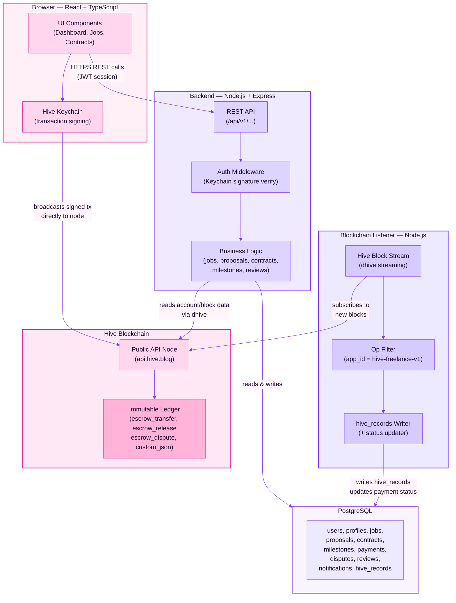
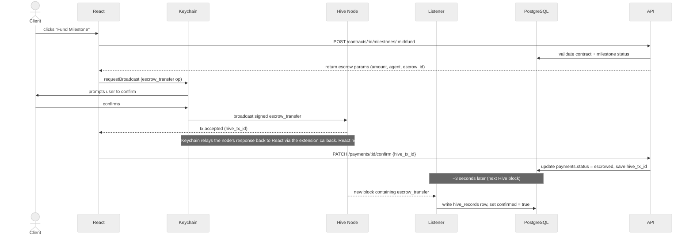
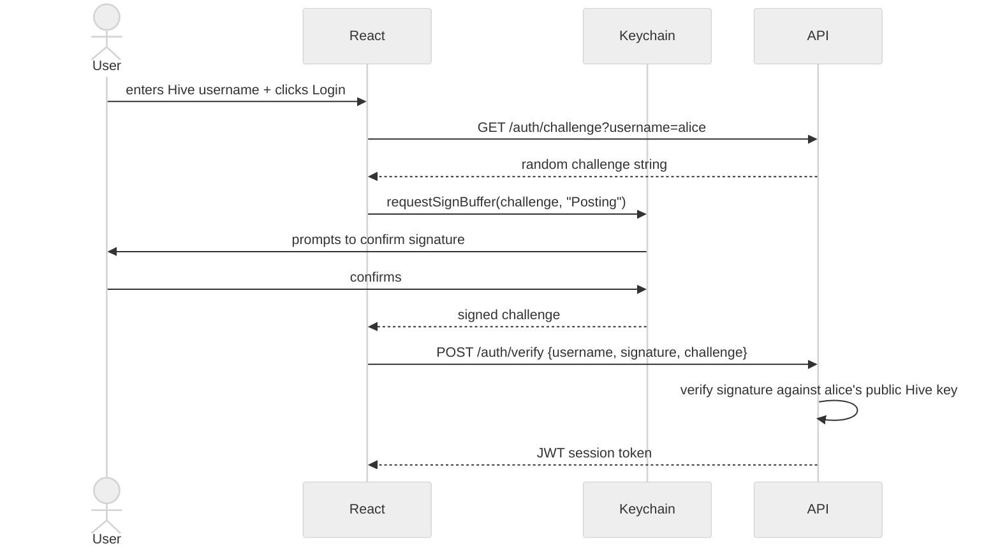

# 03 — High-Level Architecture & API Endpoints

---

## Overview

The system is composed of four layers and one background service. The key architectural distinction from a standard web app is the blockchain listener — a background Node.js process that subscribes to the live Hive chain, filters for this app's operations, and keeps the PostgreSQL database in sync with on-chain state. This is what makes Hive a first-class part of the architecture rather than an optional add-on.

---

## System Architecture Diagram

---

## Key Data Flow — Funding a Milestone (the core Hive interaction)

This is the most important flow to understand. It shows exactly where the blockchain earns its keep.

---

## Layer Responsibilities

| Layer | Responsibility | Does NOT do |
|-------|---------------|-------------|
| React frontend | UI, routing, Keychain integration, direct tx broadcasting | business logic, DB access |
| Express API | Auth, validation, business logic, DB reads/writes | hold private keys, broadcast txs |
| Blockchain listener | Stream blocks, filter ops, write hive_records, update payment status | serve HTTP requests |
| PostgreSQL | Relational data, fast queries, source of truth for app state | on-chain enforcement |
| Hive blockchain | Immutable audit trail, escrow locking/release, reputation anchoring | application logic |

---

## Auth Flow

Authentication uses Hive Keychain's `requestSignBuffer` — no password, no private key ever touches our server.

---

## API Endpoints

Base URL: `/api/v1`  
Auth: JWT Bearer token on all protected routes (marked 🔒)

---

### Auth

| Method | Endpoint | Auth | Description |
|--------|----------|------|-------------|
| GET | `/auth/challenge` | — | Get a sign challenge for a Hive username |
| POST | `/auth/verify` | — | Verify signed challenge, return JWT |
| POST | `/auth/logout` | 🔒 | Invalidate session |

---

### Users & Profiles

| Method | Endpoint | Auth | Description |
|--------|----------|------|-------------|
| GET | `/users` | — | Search/browse freelancers (filterable by skills, category, hourly rate) |
| GET | `/users/:username` | — | Get public profile by Hive username |
| PUT | `/users/me/profile` | 🔒 | Update own profile |
| GET | `/users/me/dashboard` | 🔒 | Get own dashboard data (active contracts, proposals, notifications) |

---

### Lookup (Categories & Skills)

| Method | Endpoint | Auth | Description |
|--------|----------|------|-------------|
| GET | `/categories` | — | List all categories (for job posting form + filtering) |
| GET | `/skills` | — | List all skills (for profile editing + job filtering) |

---

### Jobs

| Method | Endpoint | Auth | Description |
|--------|----------|------|-------------|
| GET | `/jobs` | — | List open jobs (paginated, filterable by category/skills/budget) |
| GET | `/jobs/:id` | — | Get single job + proposals count |
| POST | `/jobs` | 🔒 | Create a new job (client only) |
| PUT | `/jobs/:id` | 🔒 | Edit a job (owner only, status = draft/open) |
| DELETE | `/jobs/:id` | 🔒 | Soft-delete a job (owner only) |

---

### Proposals

| Method | Endpoint | Auth | Description |
|--------|----------|------|-------------|
| GET | `/jobs/:id/proposals` | 🔒 | List proposals on a job (client/owner only) |
| POST | `/jobs/:id/proposals` | 🔒 | Submit a proposal (freelancer only) |
| PUT | `/proposals/:id` | 🔒 | Edit own proposal (while pending) |
| DELETE | `/proposals/:id` | 🔒 | Withdraw own proposal |
| POST | `/proposals/:id/accept` | 🔒 | Accept a proposal → creates `contracts` row in DB, returns contract data + `custom_json` payload for client to broadcast on-chain (Posting key via Keychain). Client calls back with `hive_tx_id` to save to `contracts.hive_tx_id`. (client only) |
| POST | `/proposals/:id/accept/confirm` | 🔒 | Record `hive_tx_id` from client's contract creation broadcast → saves to `contracts.hive_tx_id` (client only) |
| POST | `/proposals/:id/reject` | 🔒 | Reject a proposal (client only) |

---

### Contracts

| Method | Endpoint | Auth | Description |
|--------|----------|------|-------------|
| GET | `/contracts` | 🔒 | List own contracts (as client or freelancer) |
| GET | `/contracts/:id` | 🔒 | Get contract detail + milestones + payment status |
| POST | `/contracts/:id/complete` | 🔒 | First party initiates completion → sets `completion_initiated_by` and `completion_initiated_at` on the contract row. `status` remains `active`. |
| POST | `/contracts/:id/complete/confirm` | 🔒 | Second (other) party confirms → `status` flips from `active` → `completed` atomically. Opens the review window for both parties. |
| POST | `/contracts/:id/cancel` | 🔒 | Cancel a contract. Triggered by: mutual agreement (both parties call), admin override after dispute resolution, or client cancellation before any milestone is funded. For any payments with status `escrowed`, cancellation automatically triggers `/payments/:id/refund` for each — the backend broadcasts `escrow_release` as agent returning funds to the client. Documents the cancellation reason. |

---

### Milestones

| Method | Endpoint | Auth | Description |
|--------|----------|------|-------------|
| GET | `/contracts/:id/milestones` | 🔒 | List milestones for a contract |
| POST | `/contracts/:id/milestones` | 🔒 | Create milestone (client, while contract active) |
| PUT | `/milestones/:id` | 🔒 | Edit milestone (client, while status = pending) |
| POST | `/milestones/:id/submit` | 🔒 | Freelancer marks milestone as submitted |
| POST | `/milestones/:id/approve` | 🔒 | Client approves submitted milestone → broadcasts `custom_json` on-chain. Does NOT automatically release funds. |
| POST | `/milestones/:id/dispute` | 🔒 | Either party raises a dispute on this milestone |

> **Approve vs. Release:** These are intentionally two separate actions. Milestone approval (`/approve`) records the client's acceptance on-chain via `custom_json`. Fund release (`/payments/:id/release`) is a separate escrow operation the client then triggers. In practice the frontend presents this as a single "Approve & Release" button that calls both endpoints sequentially — but keeping them separate in the API means a client could theoretically approve a milestone without immediately releasing funds (e.g. if they want to review all milestones before releasing any). The state machine enforces that `/release` is only callable after the corresponding milestone is `approved`.

---

### Payments (escrow)

| Method | Endpoint | Auth | Description |
|--------|----------|------|-------------|
| GET | `/contracts/:id/payments` | 🔒 | List payment records for a contract |
| POST | `/contracts/:id/milestones/:mid/fund` | 🔒 | Creates a `payments` row (status = `pending`, generates `escrow_id`), returns escrow params for Keychain to broadcast. The returned `payment.id` is what subsequent `/confirm` calls reference. |
| PATCH | `/payments/:id/confirm` | 🔒 | Record confirmed hive_tx_id after Keychain broadcast → sets status to `escrowed` |
| POST | `/payments/:id/release` | 🔒 | Get release params for Keychain to broadcast (client, after milestone approved) |
| PATCH | `/payments/:id/release/confirm` | 🔒 | Record confirmed release hive_tx_id → sets status to `released` |
| POST | `/payments/:id/refund` | 🔒 (agent/admin) | Triggered server-side when a contract with escrowed funds is cancelled. Backend broadcasts `escrow_release` with `receiver = from_account` (client) as the Hive escrow agent → sets status to `refunded`. Not user-callable directly. |

> **Note on escrow flow:** For normal payment release, the API prepares parameters and the React client signs and broadcasts via Keychain using `requestBroadcast`. The one exception is refunds — these are broadcast server-side by the platform's agent account (see design note below).

---

### Disputes

| Method | Endpoint | Auth | Description |
|--------|----------|------|-------------|
| GET | `/disputes` | 🔒 | List own open disputes |
| GET | `/disputes/:id` | 🔒 | Get dispute detail |
| POST | `/disputes/:id/resolve` | 🔒 (admin) | Resolve a dispute. Both resolution paths are executed by the platform's agent account — the client is not cooperating so no Keychain flow is possible. Client's favour: agent broadcasts `escrow_release` with `receiver = from_account` → `payments.status = 'refunded'`. Freelancer's favour: agent broadcasts `escrow_release` with `receiver = to_account` → `payments.status = 'released'`. Neither path routes through the user-facing `/release/confirm` endpoint. |

---

### Messages

| Method | Endpoint | Auth | Description |
|--------|----------|------|-------------|
| GET | `/contracts/:id/messages` | 🔒 | Get message thread for a contract (paginated) |
| POST | `/contracts/:id/messages` | 🔒 | Send a message |

---

### Reviews

| Method | Endpoint | Auth | Description |
|--------|----------|------|-------------|
| POST | `/contracts/:id/reviews` | 🔒 | Submit review after contract completion |
| GET | `/users/:username/reviews` | — | Get public reviews for a user |

---

### Notifications

| Method | Endpoint | Auth | Description |
|--------|----------|------|-------------|
| GET | `/notifications` | 🔒 | List own notifications (unread first) |
| PATCH | `/notifications/:id/read` | 🔒 | Mark a notification as read |
| PATCH | `/notifications/read-all` | 🔒 | Mark all as read |

---

## Design Notes

**Why `pending_completion` is not in `contracts.status`:** The status enum (`active`, `completed`, `disputed`, `cancelled`) represents business states, not tracking states. Two-party completion confirmation is tracked via `completion_initiated_by` and `completion_initiated_at` columns on `contracts` — the status only flips to `completed` atomically when the second party confirms. This avoids bloating the enum with a transitional state, keeps status queries clean, and reconciles with the CHECK constraint defined in doc 02.

**Why `requestBroadcast` not `requestTransfer`:** `escrow_transfer` is a native Hive protocol operation distinct from a simple HIVE/HBD transfer. Keychain's `requestTransfer` only handles token transfers. Broadcasting a structured `escrow_transfer` operation (with agent, escrow_id, ratification deadline, and expiry) requires `requestBroadcast`, which accepts any valid Hive operation array.

**`escrow_id` uniqueness on Hive:** Hive requires `escrow_id` to be unique per `(from, to)` account pair on-chain — it is not a global unique integer. When the backend generates an `escrow_id` for a new payment, it must either query existing escrow operations between those two accounts to avoid collision, or use a deterministic scheme (e.g. derived from the payment row's database ID combined with a hash of the account pair) that guarantees uniqueness within that pair.

**Why the API never broadcasts transactions — and the one exception:** For all user-initiated actions (funding, releasing, auth), the backend never holds signing keys. Keychain handles all user-side broadcasting. The one exception is the platform's **agent account**: in Hive's escrow protocol, the agent is a trusted third party authorised to release funds in either direction — to the freelancer (`escrow_release` to `to_account`) or back to the client (`escrow_release` to `from_account`). The platform backend holds the agent account's active key securely server-side specifically for this purpose. Refunds and dispute resolutions are the only cases where the backend broadcasts, and both are admin/system-triggered, never user-triggered.

**Why the blockchain listener is a separate service:** The API is request-driven (responds to HTTP). The listener is event-driven (reacts to new blocks every 3s). Mixing them in one process creates lifecycle and error-handling conflicts. They share the same DB but run independently.

**JWT session after Keychain auth:** Once the signature is verified server-side against the user's public Hive key (fetchable from any public API node), we issue a standard JWT. All subsequent requests use this token — no Keychain involvement until the next transaction.

---

## Agent Key Custody

The platform backend holds the Hive agent account's active key to broadcast `escrow_release` operations for refunds and dispute resolutions. This is the single point of centralized trust in an otherwise trustless escrow flow — it warrants explicit documentation.

### What the agent key can do
- Sign `escrow_release` in either direction: to `from_account` (refund) or `to_account` (payment)
- Sign `escrow_dispute` to escalate an escrow to agent-controlled resolution

### What it cannot do
- Access user wallets or private keys
- Drain funds that are not currently locked in an active escrow
- Perform any operation unrelated to escrow (transfers, posting, voting, etc.) — the agent account should have no other activity and hold zero HIVE balance of its own

### Blast radius if compromised
An attacker with the agent key can release any currently active escrow in any direction. Maximum exposure equals the sum of all funds locked across active escrows at the time of compromise. They cannot steal funds outside of active escrows, and every release operation is permanently visible on-chain.

### Storage
- **Minimum:** environment variable injected at runtime, never committed to the codebase
- **Recommended:** secrets manager (HashiCorp Vault, AWS Secrets Manager, or GCP Secret Manager) with read access restricted to the backend service account and full access logging enabled

### Rotation procedure
1. Generate a new active key for the agent Hive account
2. Update the value in the secrets manager
3. Redeploy the backend service
4. Verify no agent operations are failing (active escrows reference account names, not keys — rotation does not invalidate existing escrows)
5. Confirm the old key is deauthorised on-chain. The `account_update` operation that replaces the active key must itself be signed — for **routine rotation**, the current active key signs its own replacement, which is fine. For **compromised rotation**, the active key cannot be trusted to sign anything safely; use the agent account's **owner key** instead, which has higher Hive account authority and must be stored separately and more securely than the active key — ideally offline or in a hardware security module — specifically for this scenario.

### Audit requirements
Every agent broadcast must be logged with: operation type, escrow ID, accounts involved, amount, initiating admin user, timestamp, and resulting hive_tx_id. Any agent broadcast not traceable to a logged admin action should trigger an immediate alert.