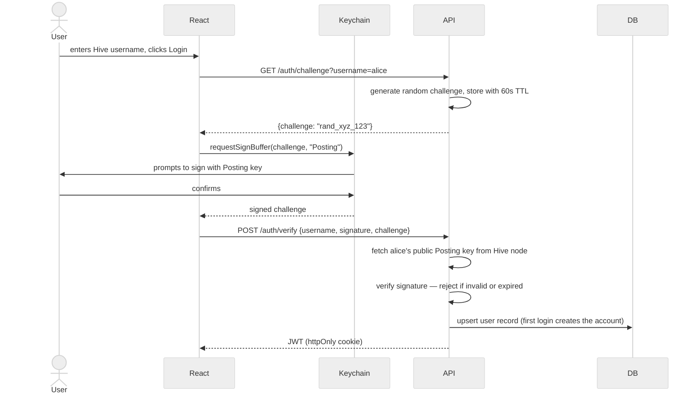
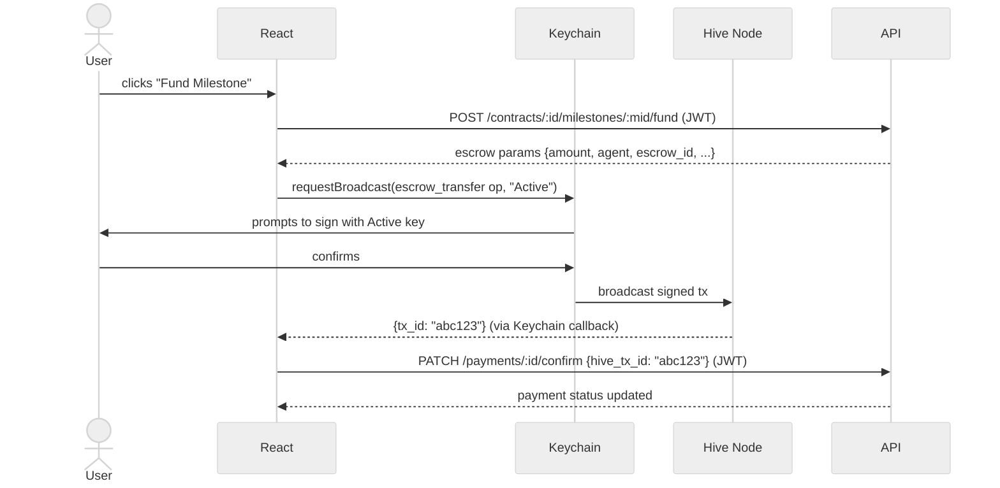

# 04 — Authentication & Roles Strategy

---

## Overview

Authentication uses Hive's cryptographic key system, not passwords. A user proves identity by signing a server-issued challenge with their Hive private key via Keychain. No password is stored. No private key ever touches the server for user operations.

Two distinct Keychain interactions:
- **Posting key** — for login (lowest privilege, cannot authorise fund movements)
- **Active key** — for escrow operations (higher privilege, used only for financial actions)

---

## Role Definitions

| Role | Description |
|------|-------------|
| `client` | Posts jobs, accepts proposals, funds milestones, approves work, releases payment |
| `freelancer` | Submits proposals, delivers milestones, ratifies escrow |
| `both` | All client AND freelancer permissions. Cannot be both roles on the same contract — enforced at the API layer (403 if `freelancer_id === client_id` on a job) |

> **MVP note:** No admin role. Dispute resolution, moderation, and admin dashboards are Phase 2. There are only three valid role values: `client`, `freelancer`, `both`.

---

## Permission Matrix

| Action | Client | Freelancer | Both |
|--------|:------:|:----------:|:----:|
| Browse jobs | ✅ | ✅ | ✅ |
| Post a job | ✅ | ❌ | ✅ |
| Submit a proposal | ❌ | ✅ | ✅ |
| View proposals on own job | ✅ | ❌ | ✅ |
| Accept / reject proposal | ✅ | ❌ | ✅ |
| Create milestones | ✅ | ❌ | ✅ |
| Fund a milestone (escrow) | ✅ | ❌ | ✅ |
| Ratify escrow (`escrow_approve`) | ❌ | ✅ | ✅ |
| Submit a milestone | ❌ | ✅ | ✅ |
| Approve a milestone | ✅ | ❌ | ✅ |
| Release payment | ✅ | ❌ | ✅ |
| Submit a review | ✅ | ✅ | ✅ |
| Initiate contract completion | ✅ | ✅ | ✅ |
| Cancel contract (pre-funding only) | ✅ | ✅ | ✅ |

---

## Authentication Flow

### Login (Posting Key)



**Challenge TTL:** 60 seconds. Single-use — invalidated immediately after verification.

---

### Transaction Signing (Active Key)

The Active key is required for financial operations. The JWT session alone is not sufficient to authorise a blockchain transaction — the user must actively confirm each financial action via Keychain.



---

## JWT Structure

```json
{
  "sub":      "42",
  "username": "alice",
  "role":     "freelancer",
  "iat":      1720000000,
  "exp":      1720086400
}
```

| Field | Value | Notes |
|-------|-------|-------|
| `sub` | `users.id` | Internal DB user ID |
| `username` | `hive_username` | For display and Hive lookups |
| `role` | `client / freelancer / both` | Drives authorization middleware |
| `iat` | Unix timestamp | Issued at |
| `exp` | `iat + 24h` | 24-hour session for all roles |

**Storage:** `httpOnly`, `Secure`, `SameSite=Strict` cookie — not `localStorage` (prevents XSS from reading the token).

**Re-login:** Required after expiry. Keychain makes this a two-click operation so 24h is acceptable.

---

## Authorization Implementation

### Middleware chain

```
POST /milestones/:id/approve
  → authMiddleware       (valid JWT? → populate req.user)
  → roleGuard(['client','both'])  (correct role?)
  → ownershipCheck       (is this their contract?)
  → handler
```

### Ownership checks

| Endpoint | Check |
|----------|-------|
| `PUT /jobs/:id` | `job.client_id === req.user.id` |
| `POST /proposals/:id/accept` | `job.client_id === req.user.id` |
| `POST /milestones/:id/approve` | `contract.client_id === req.user.id` |
| `POST /milestones/:id/submit` | `contract.freelancer_id === req.user.id` |
| `POST /payments/:id/ratify` | `contract.freelancer_id === req.user.id` |
| `GET /jobs/:id/proposals` | `job.client_id === req.user.id` |
| `GET /contracts/:id` | `contract.client_id === req.user.id OR contract.freelancer_id === req.user.id` |

---

## Key Type Reference — All On-Chain Operations

| Operation | Hive Op | Key | Broadcaster | Triggered by |
|-----------|---------|-----|-------------|-------------|
| Fund milestone | `escrow_transfer` | **Active** | Client via Keychain | `POST /contracts/:id/milestones/:mid/fund` |
| Ratify escrow | `escrow_approve` | **Active** | Freelancer via Keychain | `POST /payments/:id/ratify` |
| Release payment | `escrow_release` | **Active** | Client via Keychain | `POST /payments/:id/release` |
| Cooperative refund | `escrow_release` | **Active** | Freelancer via Keychain | `POST /payments/:id/refund` |
| Create contract | `custom_json` | **Posting** | Client via Keychain | `POST /proposals/:id/accept` |
| Approve milestone | `custom_json` | **Posting** | Client via Keychain | `POST /milestones/:id/approve` |
| Submit review | `custom_json` | **Posting** | Either party via Keychain | `POST /contracts/:id/reviews` |

> **Active key only for fund movements.** Using Active key for `custom_json` operations (milestone approval, reviews) is explicitly wrong — it unnecessarily exposes the higher-privilege key on routine actions.

---

## What Was Intentionally Cut for MVP

| Cut item | Why | Phase 2 |
|----------|-----|---------|
| Admin role | No dispute resolution or admin dashboard in MVP | ✓ |
| `is_super_admin` field | Requires admin governance infrastructure | ✓ |
| Token TTL tiers (4h admin, 2h super-admin) | No admin role in MVP; flat 24h for all | ✓ |
| `token_valid_after` / session revocation | Requires extra DB lookup per request; premature for MVP | ✓ |
| Agent key rotation procedures | Operational concern; deferred to Phase 2 runbooks | ✓ |
| Emergency rotation 2-of-3 approval | No super-admin structure in MVP | ✓ |
