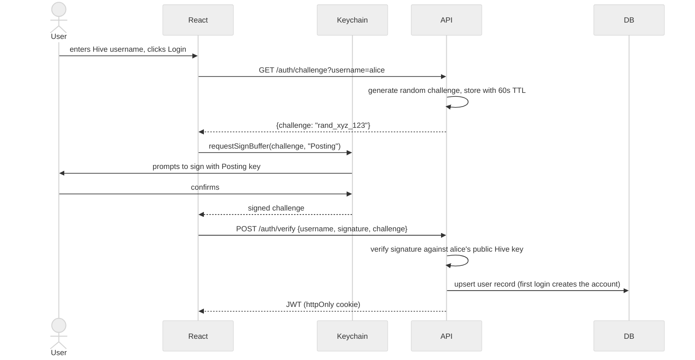
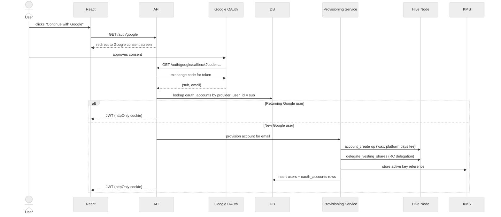
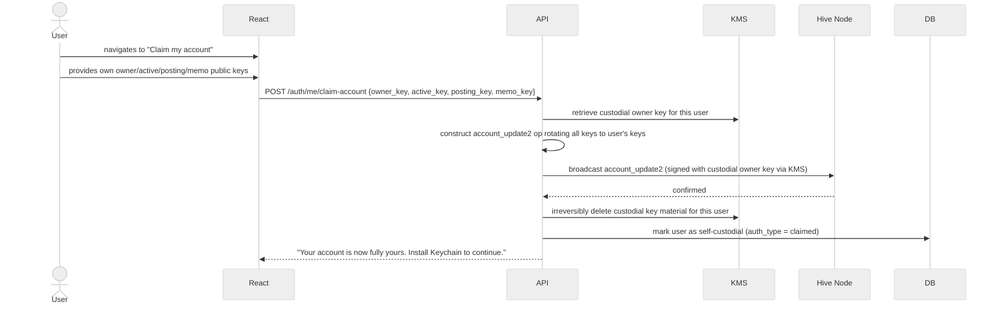
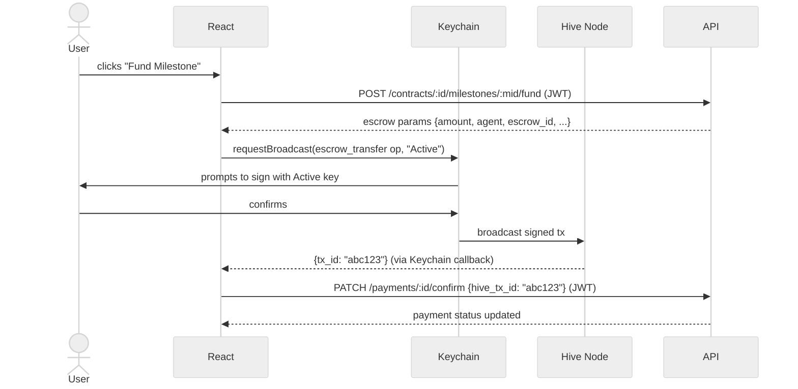

# 04 — Authentication & Roles Strategy

---

## Overview

Two authentication paths. Users with an existing Hive account use **Hive Keychain** (challenge/response). Users without one use **Google OAuth** — the platform provisions a Hive account and delegates Resource Credits on their behalf. Both paths issue the same JWT on success.

All server-side transaction signing uses `@hiveio/wax`. Browser-side Keychain signing uses `@hiveio/signers-keychain`.

---

## Role Definitions

| Role | Description |
|------|-------------|
| `client` | Posts jobs, accepts proposals, funds milestones, approves work, releases payment |
| `freelancer` | Submits proposals, delivers milestones, ratifies escrow, cooperative refunds |
| `both` | All client AND freelancer permissions. 403 enforced if same user is both client and freelancer on the same contract |


---

## Permission Matrix

| Action | Client | Freelancer | Both |
|--------|:------:|:----------:|:----:|
| Browse jobs | ✅ | ✅ | ✅ |
| Post a job | ✅ | ❌ | ✅ |
| Submit a proposal | ❌ | ✅ | ✅ |
| View proposals on own job | ✅ | ❌ | ✅ |
| Accept / reject proposal | ✅ | ❌ | ✅ |
| Create milestones | ✅ | ❌ | ✅ |
| Fund a milestone (escrow) | ✅ | ❌ | ✅ |
| Ratify escrow (`escrow_approve`) | ❌ | ✅ | ✅ |
| Submit a milestone | ❌ | ✅ | ✅ |
| Approve a milestone | ✅ | ❌ | ✅ |
| Release payment | ✅ | ❌ | ✅ |
| Cooperative refund broadcast | ❌ | ✅ | ✅ |
| Submit a review | ✅ | ✅ | ✅ |
| Initiate contract completion | ✅ | ✅ | ✅ |
| Cancel contract (pre-funding only) | ✅ | ✅ | ✅ |

---

## Authentication Flows

### Path 1 — Hive Keychain (native Hive users)



**Challenge TTL:** 60 seconds. Single-use — invalidated immediately after verification.

### Path 2 — Google OAuth (users without a Hive account)



> **RC delegation is mandatory.** A brand-new Hive account has ~0 Resource Credits and cannot broadcast any transaction. The provisioning service delegates RC immediately on account creation. Without this, all on-chain operations will silently fail for new users.

> **Google users are custodial by default — but claimable.** Their active key is held in the KMS and all escrow transactions are signed server-side on their behalf. They never install Keychain. However, accounts must be claimable: the user can bring their own keys and take self-custody at any time (see Claim/Hand-over Path below).

> **Custodial surface:** The KMS holds an active key for every Google-provisioned user, not just the platform agent. Apply the same rigor to this vault: per-user key isolation (separate KMS key per account), least-authority signing scope, audit logging on every use. Users must be explicitly informed in UX and ToS that the platform is custodying their keys.

---

### Claim / Hand-over Path (Google-provisioned users → self-custody)

A cross-project standard. Google-provisioned accounts are the user's — the platform holds keys custodially by default but must provide an irreversible exit to self-custody.



After claim, the platform cannot sign for this user. They must install Hive Keychain (or another signer) for any future on-chain actions. The `account_update2` operation uses the owner key (highest authority) to rotate all four key roles simultaneously — this is why the provisioning service must store the owner key in KMS, not just the active key.

---

### Transaction Signing (Active Key — Keychain users)



---

## JWT Structure

```json
{
  "sub":      "42",
  "username": "alice",
  "role":     "freelancer",
  "iat":      1720000000,
  "exp":      1720086400
}
```

| Field | Value | Notes |
|-------|-------|-------|
| `sub` | `users.id` | Internal DB user ID |
| `username` | `hive_username` | For display and Hive lookups |
| `role` | `client / freelancer / both` | Drives authorization middleware |
| `iat` | Unix timestamp | Issued at |
| `exp` | `iat + 24h` | 24-hour session for all roles |

**Storage:** `httpOnly`, `Secure`, `SameSite=Strict` cookie — not `localStorage`.

---

## Authorization Implementation

### Middleware chain

```
POST /milestones/:id/approve
  → authMiddleware       (valid JWT? → populate req.user)
  → roleGuard(['client','both'])
  → ownershipCheck       (is this their contract?)
  → handler
```

### Ownership checks

| Endpoint | Check |
|----------|-------|
| `PUT /jobs/:id` | `job.client_id === req.user.id` |
| `POST /proposals/:id/accept` | `job.client_id === req.user.id` |
| `POST /milestones/:id/approve` | `contract.client_id === req.user.id` |
| `POST /milestones/:id/submit` | `contract.freelancer_id === req.user.id` |
| `POST /payments/:id/ratify` | `contract.freelancer_id === req.user.id` |
| `GET /jobs/:id/proposals` | `job.client_id === req.user.id` |
| `GET /contracts/:id` | `contract.client_id === req.user.id OR contract.freelancer_id === req.user.id` |

---

## Key Type Reference — All On-Chain Operations

| Operation | Hive Op | Key | Broadcaster |
|-----------|---------|-----|-------------|
| Fund milestone | `escrow_transfer` | Active | Keychain user / KMS (Google user, via wax) |
| Ratify escrow | `escrow_approve` | Active | Keychain user / KMS (Google user, via wax) |
| Agent auto-ratify | `escrow_approve` | Active | Agent backend (wax + KMS) |
| Release payment | `escrow_release` | Active | Keychain user / KMS (Google user, via wax) |
| Cooperative refund | `escrow_release` | Active | Freelancer Keychain / KMS |
| Create contract | `custom_json` | **Posting** | Keychain user / KMS (Google user, via wax) |
| Approve milestone | `custom_json` | **Posting** | Keychain user / KMS (Google user, via wax) |
| Submit review | `custom_json` | **Posting** | Either party / KMS |
| Provision account | `account_create` | Active | Provisioning service (wax + KMS) |
| Delegate RC | `delegate_vesting_shares` | Active | Provisioning service (wax + KMS) |
| Raise dispute | `escrow_dispute` | Active | Keychain user / KMS (Google user, via wax) |
| Admin resolve dispute | `escrow_release` | Active | Agent backend (wax + KMS), authorized team member |
| Claim account | `account_update2` | **Owner** | Platform KMS (custodial owner key) — rotates all keys to user's keys then wipes KMS copies |

> Active key is used only for operations that move or control funds and for provisioning. Using Active key for `custom_json` operations (approval, review) is wrong for Keychain users — it needlessly exposes the higher-privilege key.