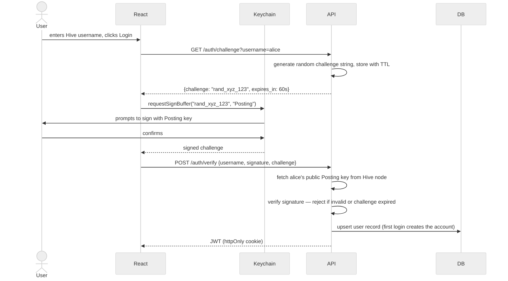
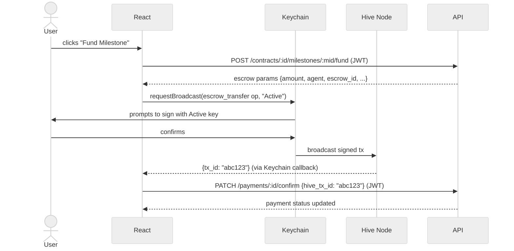

# 04 — Authentication & Roles Strategy

---

## Overview

Authentication is built on Hive's cryptographic key system rather than passwords. A user proves identity by signing a server-issued challenge with their Hive private key via Keychain — the backend verifies the signature against the user's public key on-chain. No password is ever stored. No private key ever touches the server for user operations.

Two separate Keychain interactions exist for two separate purposes: the Posting key for login (low privilege, safe to use frequently), and the Active key for escrow operations (higher privilege, used only when a financial operation is required).

---

## Role Definitions

| Role | Description |
|------|-------------|
| `client` | Posts jobs, reviews proposals, funds and approves milestones, releases payments, initiates completion or cancellation |
| `freelancer` | Submits proposals, submits milestone deliverables, raises disputes, initiates completion or cancellation |
| `both` | Holds all client AND freelancer permissions. Cannot be both client and freelancer on the same contract — enforced at application layer. |
| `admin` | Resolves disputes, overrides cancellations, views all platform data, triggers agent broadcasts for dispute resolution. Cannot post jobs or submit proposals. |

Role is stored in `users.role` (CHECK constraint in doc 02 enforces valid values). A user selects `client` or `freelancer` at registration; `both` is available if they want to operate in both capacities. `admin` is never self-assigned — see Admin Governance below.

---

## Permission Matrix

| Action | Client | Freelancer | Both | Admin |
|--------|:------:|:----------:|:----:|:-----:|
| Browse jobs & freelancer profiles | ✅ | ✅ | ✅ | ✅ |
| Post a job | ✅ | ❌ | ✅ | ❌ |
| Submit a proposal | ❌ | ✅ | ✅ | ❌ |
| View proposals on own job | ✅ | ❌ | ✅ | ✅ |
| Accept / reject a proposal | ✅ | ❌ | ✅ | ❌ |
| Create milestones | ✅ | ❌ | ✅ | ❌ |
| Fund a milestone (escrow) | ✅ | ❌ | ✅ | ❌ |
| Submit a milestone | ❌ | ✅ | ✅ | ❌ |
| Approve a milestone | ✅ | ❌ | ✅ | ❌ |
| Release payment | ✅ | ❌ | ✅ | ❌ |
| Raise a dispute | ✅ | ✅ | ✅ | ❌ |
| Resolve a dispute | ❌ | ❌ | ❌ | ✅ |
| Send messages in a contract | ✅ | ✅ | ✅ | ❌ |
| Submit a review | ✅ | ✅ | ✅ | ❌ |
| Initiate contract completion | ✅ | ✅ | ✅ | ❌ |
| Initiate contract cancellation | ✅ | ✅ | ✅ | ✅ |
| View all contracts (platform-wide) | ❌ | ❌ | ❌ | ✅ |
| Trigger agent broadcast (refund / release) | ❌ | ❌ | ❌ | ✅ (via dispute resolution) |
| Create new admin accounts | ❌ | ❌ | ❌ | ✅ |
| Invoke emergency key rotation | ❌ | ❌ | ❌ | Super-admin only (see below) |

> **Edge case — `both` role on the same contract:** A user with `role = 'both'` cannot submit a proposal on a job they posted. The API enforces this check at `POST /jobs/:id/proposals`: if `proposal.freelancer_id === job.client_id`, reject with 403.

---

## Authentication Flow

### Step 1 — Login (Posting Key)

The Posting key is the lowest-privilege Hive key. It is standard practice in the Hive ecosystem to use it for login challenges — it cannot authorize transfers or escrow operations, so exposure risk is minimal.



**Challenge TTL:** 60 seconds. Expired or replayed challenges are rejected. Challenges are single-use — invalidated immediately after verification to prevent replay attacks.

---

### Step 2 — Transaction Signing (Active Key)

The Active key is required for financial operations: `escrow_transfer`, `escrow_release`, and `escrow_dispute`. Keychain is invoked again at the point of each financial action — the JWT session is not sufficient to authorize a blockchain transaction, which is intentional. The user must actively confirm each financial operation.



Keychain selects the key type automatically based on the operation — the frontend passes `"Active"` as the key type string to `requestBroadcast`.

---

### Key Type Reference — All On-Chain Operations

Not all on-chain writes require the Active key. Doc 02's on-chain table includes `custom_json` operations for non-financial events. Using Active key for these unnecessarily exposes a higher-privilege key on routine actions.

| Operation | Hive Op Type | Key Required | Broadcaster | Triggered by |
|-----------|-------------|-------------|-------------|-------------|
| Fund milestone | `escrow_transfer` | **Active** | Client via Keychain | `POST /contracts/:id/milestones/:mid/fund` |
| Release payment | `escrow_release` | **Active** | Client via Keychain | `POST /payments/:id/release` |
| Raise dispute | `escrow_dispute` | **Active** | Client or Freelancer via Keychain | `POST /milestones/:id/dispute` |
| Create contract | `custom_json` | **Posting** | Client via Keychain | `POST /proposals/:id/accept` (see note) |
| Submit proposal on-chain | `custom_json` | **Posting** | Freelancer via Keychain | `POST /jobs/:id/proposals` |
| Approve milestone on-chain | `custom_json` | **Posting** | Client via Keychain | `POST /milestones/:id/approve` |
| Submit review on-chain | `custom_json` | **Posting** | Reviewer (client or freelancer) via Keychain | `POST /contracts/:id/reviews` |

> **Contract creation flow (accept-proposal):** When a client calls `POST /proposals/:id/accept`, the API creates the `contracts` row in the DB and returns the contract data plus a `custom_json` payload for the client to broadcast on-chain. The client's Keychain broadcasts the op with their Posting key. The client then calls back with the `hive_tx_id`, which is saved to `contracts.hive_tx_id`. This two-step mirrors the milestone approval and review flows — it is not broadcast by the backend. **Doc 03 note:** the `POST /proposals/:id/accept` endpoint description should reflect this two-step (returns broadcast payload, expects a confirm callback with `hive_tx_id`).

The frontend passes `"Posting"` or `"Active"` as the `keyType` argument to `requestBroadcast` accordingly. Defaulting to Active "to be safe" for custom_json ops is explicitly wrong — it exposes the higher-privilege key on every milestone approval and review, which undercuts the key scoping rationale entirely.

---

## JWT Structure

```json
{
  "sub":            "42",
  "username":       "alice",
  "role":           "admin",
  "is_super_admin": true,
  "iat":            1720000000,
  "exp":            1720014400
}
```

| Field | Value | Notes |
|-------|-------|-------|
| `sub` | `users.id` | Internal DB user ID |
| `username` | `hive_username` | For display and Hive lookups |
| `role` | `client / freelancer / both / admin` | Drives `roleGuard` middleware |
| `is_super_admin` | `true / false` | Gates emergency rotation and super-admin-only actions |
| `iat` | Unix timestamp | Issued at |
| `exp` | `iat + TTL` | TTL varies by role — see Expiry below |

**Storage:** JWT is set as an `httpOnly`, `Secure`, `SameSite=Strict` cookie. Not stored in `localStorage` — this prevents XSS from reading the token.

**Expiry by role:**

| Role | Token TTL | Rationale |
|------|-----------|-----------|
| `client` / `freelancer` / `both` | 24 hours | Low risk, frequent use — longer session reduces Keychain re-auth friction |
| `admin` (with `is_super_admin = false`) | 4 hours | Elevated privilege — shorter window limits exposure if token is intercepted |
| `admin` (with `is_super_admin = true`) | 2 hours | Highest privilege — minimal valid session window. TTL-selection logic checks `is_super_admin` boolean, not a separate role value — there is no `role === 'super_admin'` branch. |

**Tradeoff — `is_super_admin` in JWT:** Because `is_super_admin` is a JWT claim, revoking super-admin status (e.g. demoting a user) does not take effect until the current token expires. This is acceptable for routine demotion given the 2-hour TTL. For immediate revocation see Session Revocation below. Additionally, the emergency rotation endpoint performs a **live DB check** against `users.is_super_admin` regardless of the JWT claim — the stakes of that specific action are high enough to justify the extra query and to not trust a potentially stale token.

**Signing secret:** HS256 with a secret stored in the secrets manager. Rotating the signing secret invalidates all active sessions platform-wide — an acceptable nuclear option for platform-wide security incidents.

---

## Authorization Implementation

### Middleware chain

Every protected route runs through two layers:

1. **`authMiddleware`** — verifies the JWT, attaches `req.user` (`{ id, username, role, is_super_admin }`), and checks `token_valid_after` (see Session Revocation below)
2. **`roleGuard(allowedRoles[])`** — checks `req.user.role` is in the allowed list, rejects with 403 otherwise

```
POST /proposals/:id/accept
  → authMiddleware          (valid JWT?)
  → roleGuard(['client', 'both'])  (is this user a client?)
  → ownershipCheck          (is this their job?)
  → handler
```

### Ownership checks

Role alone is not sufficient for most mutations. Every write endpoint additionally verifies that the requesting user is a party to the relevant entity:

| Endpoint | Ownership check |
|----------|----------------|
| `PUT /jobs/:id` | `job.client_id === req.user.id` |
| `POST /proposals/:id/accept` | `job.client_id === req.user.id` |
| `POST /milestones/:id/approve` | `contract.client_id === req.user.id` |
| `POST /milestones/:id/submit` | `contract.freelancer_id === req.user.id` |
| `POST /contracts/:id/complete` | `contract.client_id === req.user.id OR contract.freelancer_id === req.user.id` |
| `GET /jobs/:id/proposals` | `job.client_id === req.user.id` |
| `GET /contracts/:id` | `contract.client_id === req.user.id OR contract.freelancer_id === req.user.id` |

Admin bypasses ownership checks for read operations. Admin does NOT bypass them for client/freelancer write operations (admins cannot fund milestones or submit deliverables on behalf of users).

---

## Session Revocation

JWTs are stateless by design — a valid token keeps working until expiry regardless of what happens to the user account. The short TTLs above (4h/2h for admin/super-admin) limit the exposure window, but a compromised admin account still has a 2–4 hour active window. Given the agent key governance section documents an immediate circuit-breaker for key compromise, the auth system needs an equivalent fast-revocation lever.

### Mechanism — `token_valid_after`

A `token_valid_after TIMESTAMP` column is added to the `users` table (this requires an update to doc 02's schema). `authMiddleware` checks:

```
if (req.jwt.iat < user.token_valid_after) → reject 401
```

Setting `token_valid_after = NOW()` for a user immediately invalidates all their existing tokens — any request they make after that point fails the `iat` check, forcing re-login.

> **Doc 02 update required:** Add `token_valid_after TIMESTAMP DEFAULT NULL` to the `users` table. NULL means no revocation has been triggered (all tokens valid). The Mermaid ER diagram for `users` also needs this column added.

### Performance

This requires one DB lookup per request. For MVP, this is acceptable — the `users` table lookup on `id` (PK) is fast. For production scale, cache `token_valid_after` values in Redis with a short TTL (e.g. 30 seconds) so the check is a memory lookup rather than a DB query on every request.

### Who can invoke revocation

| Action | Who can invoke |
|--------|---------------|
| Revoke own session | Any user (logout) |
| Revoke any user's session | Super-admin |
| Revoke an admin's session | Super-admin |
| Revoke a super-admin's session | Requires 2-of-3 super-admin authorization (same as emergency rotation) |

### Revocation endpoint

`POST /admin/users/:id/revoke-session` — super-admin only, performs a live DB check (not JWT-only), logs to `admin_audit_log`.

---

### Admin account creation

Admins are not self-assigned. The first admin is seeded via an environment variable (`SEED_ADMIN_HIVE_USERNAME`) that is processed once on first deploy and sets `role = 'admin'` for that user. All subsequent admins are created by an existing admin via a dedicated internal endpoint not listed in the public API docs.

### What admins can do

- Resolve disputes and trigger the resulting agent broadcast (refund or release)
- View all contracts, disputes, and user data platform-wide
- Cancel contracts via admin override
- Create new admin accounts
- Invoke emergency key rotation (super-admins only — see below)

### Admin action logging

Every admin action is logged to a separate `admin_audit_log` table (not in the public schema but required for production) containing: `admin_user_id`, `action_type`, `target_entity_type`, `target_entity_id`, `rationale`, `timestamp`. This log is append-only and not deletable by any user including admins.

---

## Agent Account Key Governance

*Carrying forward the thread opened in doc 03.*

The agent account holds two keys relevant to this system:

| Key | Purpose | Where stored |
|-----|---------|-------------|
| Active key | Signs `escrow_release` and `escrow_dispute` for refunds and dispute resolution | Secrets manager (production) / env var (development) |
| Owner key | Signs `account_update` during key rotation | Offline — hardware wallet or physically secured paper backup |

### Who may access the active key

The backend service account (the Node.js API process) reads the active key from the secrets manager at startup. No human should have direct access to the plaintext active key outside of initial setup and rotation procedures.

### Who may invoke emergency rotation

Emergency rotation requires written authorization from **2 of 3 designated super-admins**. Super-admins are a subset of the admin role, identified by a separate `is_super_admin` boolean in the `users` table. There must always be at least 3 super-admins active — if a super-admin account is deactivated, a replacement must be designated before the deactivation completes.

### Emergency rotation procedure

1. Designated incident responder identifies suspected active key compromise
2. Obtains written authorization from 2 of 3 super-admins (Slack/email thread with explicit approval)
3. **Immediately suspend all agent broadcasts** via a circuit-breaker flag in the DB — no new refunds or dispute resolutions until rotation is complete
4. Retrieve the owner key from offline storage (requires in-person access or dual-custody procedure)
5. Generate a new active key for the agent Hive account
6. Sign the `account_update` operation with the **owner key** (not the active key — the active key cannot be trusted to safely rotate itself out when compromise is suspected; the owner key's higher authority and separate storage are specifically for this scenario)
7. Broadcast `account_update` to the Hive network
8. Update the active key value in the secrets manager
9. Redeploy the backend service with the new key
10. Lift the circuit-breaker flag — verify agent broadcasts resume correctly
11. Audit all agent operations that occurred in the window between suspected compromise and rotation completion — flag any that were not traceable to a logged admin action
12. File an incident report documenting timeline, exposure window, and affected escrows

### Routine rotation procedure

For scheduled (non-emergency) rotation, the same procedure applies from step 5 onward — no circuit-breaker suspension is required, and the current active key (which is trusted) can optionally be used to sign the `account_update` instead of the owner key. However, using the owner key is recommended even for routine rotation to keep the owner key's use practiced and its custody verified.

### Owner key custody

The owner key is stored offline. Access requires physical presence at a designated secure location or a dual-custody process (two authorized individuals must both be present). The list of individuals with access is documented separately and reviewed quarterly. The owner key is never stored digitally in plaintext under any circumstances.