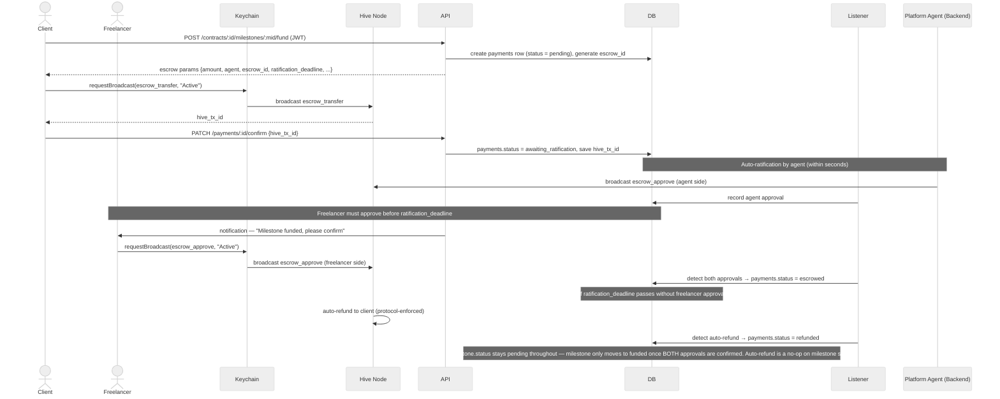
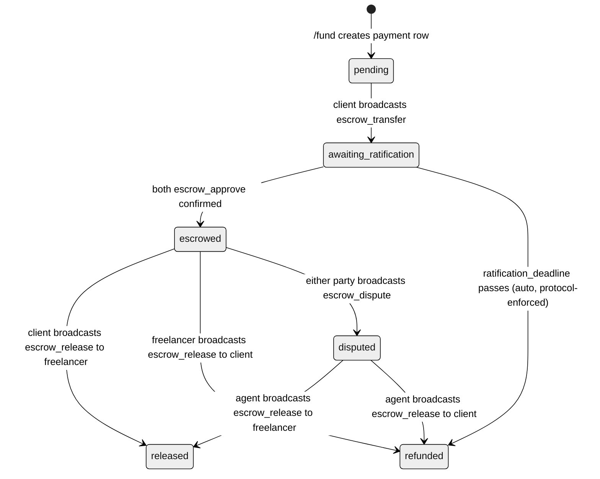

# 05 — Escrow Integration Approach
---

## Approach Decision

**Hive native escrow** — using the protocol's four built-in operations (`escrow_transfer`, `escrow_approve`, `escrow_release`, `escrow_dispute`) rather than any third-party payment service or custom implementation.

---

## Alternatives Considered

| Option | Why rejected |
|--------|-------------|
| **Stripe Connect** | Requires bank accounts and regulatory money-transmission compliance. Charges 2.9% + 30¢ per transaction — unworkable for small freelance contracts. No blockchain record. |
| **Custodial backend wallet** | Backend holds funds in a platform wallet and releases them. Reintroduces the single point of trust the whole platform exists to avoid. If backend is compromised, all escrowed funds are at risk. |
| **Ethereum smart contract** | Hive does not have a general-purpose smart contract layer. Building on Ethereum would abandon the fee-less, fast-block Hive infrastructure the rest of the platform depends on. |
| **Hive multisig accounts** | A 2-of-3 multisig between client, freelancer, and agent is technically possible but requires custom key management, is harder to audit, and replicates what the native escrow protocol already provides cleanly. |
| **Custom `custom_json` escrow** | Rolling a custom escrow protocol on top of `custom_json` gives up the protocol-level enforcement of Hive's native operations. Funds could be moved outside the custom logic. |

**Why Hive native escrow earns its keep here:** The protocol enforces the three-party arrangement at the chain level — no party can move funds unilaterally, the agent cannot run away with the money (funds are locked in the escrow mechanism, not held in the agent's wallet), and the entire lifecycle is permanently auditable on-chain.

---

## The Four Hive Escrow Operations

### 1. `escrow_transfer` — creates and funds the escrow

Called by the `from` account (client). Locks funds immediately.

| Parameter | Type | Description |
|-----------|------|-------------|
| `from` | account | Client's Hive username |
| `to` | account | Freelancer's Hive username |
| `agent` | account | Platform's agent account |
| `escrow_id` | uint32 | Unique per `(from, to)` pair — see generation below |
| `hbd_amount` | asset | Amount in HBD (recommended — see Currency below) |
| `hive_amount` | asset | Amount in HIVE (set to `0.000 HIVE` if using HBD) |
| `fee` | asset | Agent fee — deducted from `from` at execution, not at release |
| `ratification_deadline` | datetime | Deadline for both `to` and `agent` to call `escrow_approve` |
| `escrow_expiration` | datetime | Overall escrow expiry — see Edge Cases |
| `json_meta` | JSON | Metadata: `{ "app": "hive-freelance-v1", "contract_id": "...", "milestone_id": "..." }` |

**Key type:** Active (client broadcasts via Keychain `requestBroadcast`)

> **Fee timing:** The agent fee is deducted from the `from` account along with the escrow amount at the moment `escrow_transfer` executes — not when the escrow is resolved. For MVP, fee is set to `0.000 HBD`.

---

### 2. `escrow_approve` — ratification by `to` and `agent`

**Both the freelancer (`to`) AND the agent must call `escrow_approve` before `ratification_deadline`.** This is the critical three-party ratification step. Neither approval can be revoked once given.

| Who | How | When |
|-----|-----|------|
| Platform agent | Backend auto-broadcasts immediately after confirming the `escrow_transfer` on-chain | Automatic, within seconds |
| Freelancer (`to`) | UI notification prompts freelancer to confirm via Keychain (`requestBroadcast`, Active key) | Within `ratification_deadline` window |

If either party does not approve by `ratification_deadline`, all funds (including the fee) automatically return to `from` — no manual intervention required. The blockchain handles this.

**Key type for freelancer approval:** Active (requires transfer authority — this must be added to doc 04's key type table)

---

### 3. `escrow_release` — moves funds out of escrow

**Who can call `escrow_release` depends entirely on whether a dispute has been raised:**

| State | Who can release | Can release to |
|-------|----------------|---------------|
| No dispute, not expired | `from` (client) | `to` only (payment to freelancer) |
| No dispute, not expired | `to` (freelancer) | `from` only (cooperative refund to client) |
| Disputed | `agent` only | Either `from` or `to` (agent decides) |

> **Nobody can release funds to themselves.** This is enforced at the protocol level. The only way a client can get a refund is if the freelancer calls `escrow_release` to `from`, or if the agent resolves a dispute in the client's favour. The only way a freelancer gets paid is if the client calls `escrow_release` to `to`, or if the agent resolves in the freelancer's favour.

**Key type:** Active for `from` or `to`; agent uses its server-held Active key

---

### 4. `escrow_dispute` — escalates to agent control

Either `from` or `to` can raise a dispute. Once disputed, only the agent can move funds. Disputes cannot be undisputed.

| Parameter | Value |
|-----------|-------|
| `from` | Client's Hive username — identifies which escrow |
| `to` | Freelancer's Hive username — identifies which escrow |
| `agent` | Platform agent account — identifies which escrow |
| `escrow_id` | The escrow being disputed — must match an active escrow for this `(from, to, agent)` triple |
| `who` | Either `from` or `to` — identifies which party is raising the dispute |

**Key type:** Active (whichever party raises it, via Keychain)

---

## Ratification Flow (Three-Party)

This flow is the detail not previously captured in docs 03 or 04. Milestone funding requires three on-chain operations across three parties, not two.



> **New API endpoint required (doc 03 update):** `POST /payments/:id/ratify` — freelancer hits this endpoint which returns the `escrow_approve` payload for Keychain to broadcast. After broadcast, freelancer calls `PATCH /payments/:id/ratify/confirm {hive_tx_id}`. Mirrors the fund/confirm pattern used elsewhere.

---

## Release Flows

### Normal payment release (client pays freelancer)

After milestone is approved, client calls `escrow_release` to `to`:

1. Client: `POST /payments/:id/release` → API returns release params
2. Client: Keychain `requestBroadcast(escrow_release, "Active")` with `receiver = to_account`
3. Client: `PATCH /payments/:id/release/confirm {hive_tx_id}`
4. `payments.status = released`

### Cooperative refund (mutual cancellation)

When both parties agree to cancel, the **freelancer** (not the agent) calls `escrow_release` releasing to `from`. The agent cannot release funds without a dispute being raised first.

1. Both parties call `POST /contracts/:id/cancel` — backend records mutual agreement
2. Backend prompts freelancer: "Please confirm refund to client"
3. Freelancer: Keychain `requestBroadcast(escrow_release, "Active")` with `receiver = from_account`
4. Freelancer: `PATCH /payments/:id/refund/confirm {hive_tx_id}`
5. `payments.status = refunded`

> **Doc 03 correction required:** The original `/payments/:id/refund` description says the agent broadcasts the refund. This is only correct for disputed refunds. For cooperative cancellation, the freelancer broadcasts. Two separate paths exist: (a) cooperative — freelancer Keychain; (b) disputed — agent backend. The `/cancel` endpoint should clarify that cooperative refund requires freelancer action, not automatic agent broadcast.

### Disputed refund or release (admin resolution)

1. Either party: `POST /milestones/:id/dispute` → Keychain broadcasts `escrow_dispute`
2. Admin reviews evidence and calls `POST /disputes/:id/resolve` with direction (`to_client` or `to_freelancer`)
3. Agent backend broadcasts `escrow_release` to the appropriate party
4. `payments.status = refunded` or `released`

This is the **only** scenario where the agent broadcasts `escrow_release`.

---

## Escrow State Machine



> **Doc 02 update required:** `payments.status` CHECK constraint must add `'awaiting_ratification'`. Current constraint: `CHECK IN ('pending','escrowed','released','refunded','disputed')`. Updated: add `'awaiting_ratification'` between `pending` and `escrowed`.

---

## Escrow Parameter Design

### Currency — HBD recommended

| Currency | Stability | Recommendation |
|----------|----------|----------------|
| HIVE | Volatile — can lose significant value over a multi-week contract | Use only if client specifically requests |
| HBD | Dollar-pegged ($1 USD) — stable for the duration of a service contract | **Default for all escrow operations** |

For implementation: set `hbd_amount` to the contract value and `hive_amount` to `"0.000 HIVE"`.

### Recommended parameter values

| Parameter | Recommended value | Rationale |
|-----------|------------------|-----------|
| `ratification_deadline` | 24 hours from `escrow_transfer` | Enough time for freelancer to see notification and approve; not so long it leaves funds in limbo |
| `escrow_expiration` | Contract end date + 30 days | Buffer after contract completion for dispute window; cap at 6 months for long contracts |
| `fee` | `0.000 HBD` (MVP) | No platform cut on escrow operations for MVP — can revisit for revenue model |
| `escrow_id` | `TRUNCATE(SHA256(payment_id || ':' || from_account || ':' || to_account), 4 bytes)` as uint32, with collision check | Because `payment_id` is a BIGSERIAL PK, two different payments always produce different hash inputs even for the same `(from, to)` pair — the hash is the uniqueness mechanism. The uint32 truncation creates a ~1-in-4-billion theoretical collision risk; the collision check is a safety net that resolves the rare case, not the primary guarantee. Never use modulo of `payment_id` alone — it is not injective past 2^32 and can collide for the same `(from, to)` pair at small IDs. |

### `escrow_id` generation

Hive requires `escrow_id` to be unique per `(from, to)` account pair. The recommended scheme:

```
escrow_id = first 4 bytes of SHA256(payment_id || ':' || from_account || ':' || to_account), as uint32
```

Because `payment_id` is a globally unique BIGSERIAL PK, two different payments always produce different hash inputs even between the same `(from, to)` pair — the hash itself is the uniqueness mechanism. The uint32 truncation introduces a theoretical ~1-in-4-billion collision probability, which the collision check (querying active escrows for the `(from, to)` pair) resolves before broadcasting. The collision check is a safety net, not load-bearing. If a collision is detected, append an incrementing nonce to the hash input and retry.

**Never use `payment_id % 2^32`** — modulo is not injective above 2^32 and two payments between the same account pair could collide at small IDs before that threshold.

---

## Edge Cases

| Scenario | What happens | DB handling |
|----------|-------------|-------------|
| Freelancer never calls `escrow_approve` | Hive auto-refunds to client at `ratification_deadline` | Listener detects refund → `payments.status = refunded`. Milestone remains `pending` — it was never moved to `funded` since ratification didn't complete. |
| Agent never calls `escrow_approve` | Same — auto-refund at `ratification_deadline` | Same. This shouldn't happen since agent auto-approves immediately — requires liveness monitoring (see below). |
| `escrow_expiration` passes, no dispute | Either party can still release to the other; expiry only affects the agent's ability to control funds after a dispute | No DB change needed; release flow still works normally |
| `escrow_expiration` passes, dispute raised before expiry | Agent retains full control — expiry does not affect disputed escrows | Normal dispute resolution flow |
| Freelancer refuses to approve cooperative refund | Cooperative cancellation fails — either party must raise a formal dispute | `/cancel` route does not complete; dispute required |
| Agent backend is offline during ratification window | Agent's `escrow_approve` fails to broadcast; `ratification_deadline` may pass → auto-refund | Requires a separate liveness/alerting system (see below) — distinct from the key-compromise circuit-breaker described in docs 03/04 |

### Re-funding after auto-refund

Auto-refund is a normal-path scenario — the freelancer may simply miss a notification. The re-funding flow is:

1. Listener detects auto-refund → sets `payments.status = refunded`
2. Milestone status remains `pending` (never changed during ratification window)
3. Client calls `POST /contracts/:id/milestones/:mid/fund` again
4. API creates a **new** `payments` row with a new `escrow_id` — the old row is kept as `refunded` for audit trail
5. New ratification flow proceeds from scratch

The milestone is re-fundable because its status never left `pending`. The contract status is unaffected — it remains `active`.

### Agent liveness monitoring

The agent-offline scenario is distinct from key compromise (which has a manual circuit-breaker per docs 03/04). A missed `escrow_approve` broadcast is a liveness failure, not a security failure. Handling this requires a separate automated monitoring system — a watchdog that checks whether the agent has approved every `awaiting_ratification` payment within a configurable window (e.g. 5 minutes of the `escrow_transfer` being confirmed) and alerts on failure. This system is **out of scope for this planning document** and should be addressed in operational runbooks before production deployment.
