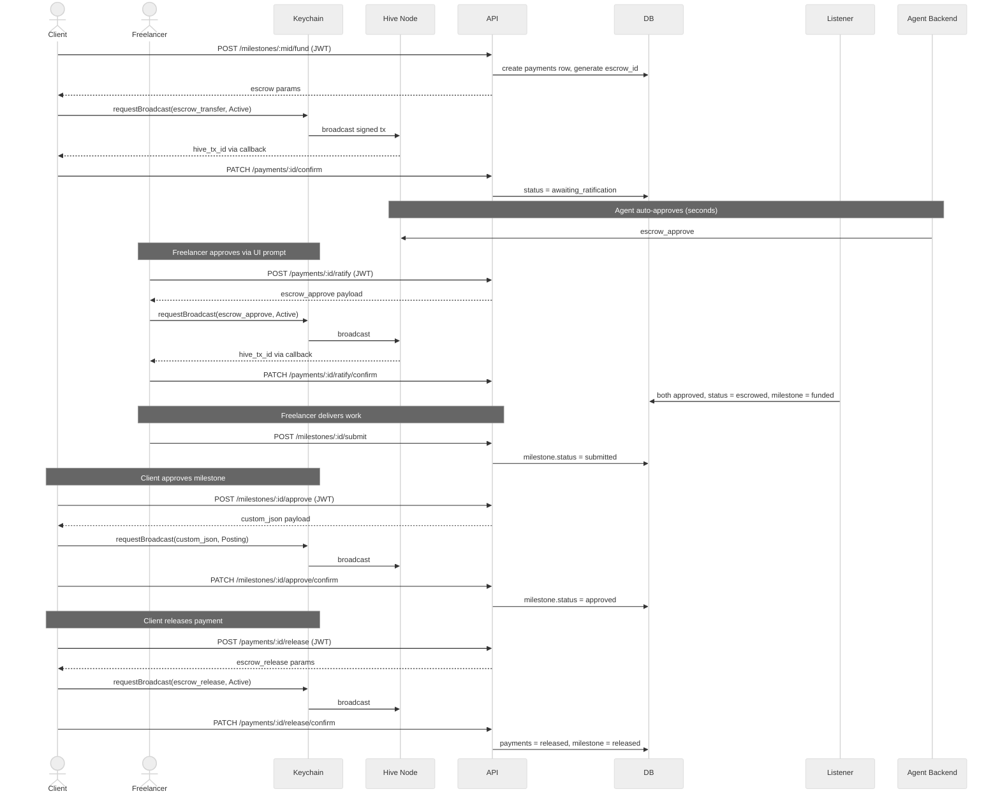
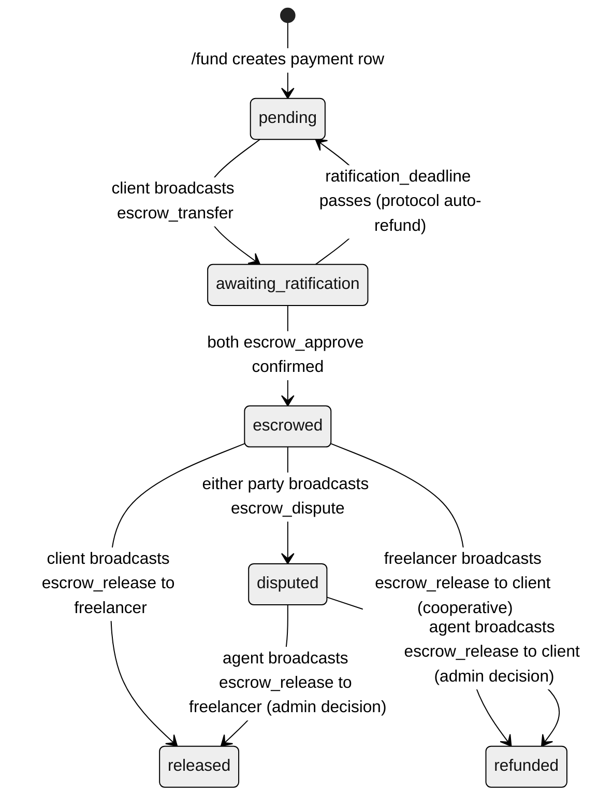

# 05 — Escrow Integration Approach

---

## Approach Decision

**Hive native escrow** — using the protocol's built-in operations (`escrow_transfer`, `escrow_approve`, `escrow_release`) via `@hiveio/wax` (Greateck standard). All server-side transaction building and signing uses WAX.

**MVP scope:** happy path only (fund → ratify → submit → approve → release) plus cooperative refund. Disputes and admin-mediated resolution are Phase 2.

> **RC prerequisite:** A brand-new Hive account has ~0 Resource Credits and cannot broadcast any transaction — not `escrow_transfer`, not `custom_json`, nothing. The provisioning service delegates RC at account creation (Google users). For native Keychain users, a first-login RC check should warn and offer delegation. Without sufficient RC, all on-chain operations silently fail.

---

## Alternatives Considered

| Option | Why rejected |
|--------|-------------|
| **Stripe Connect** | Requires bank accounts and regulatory compliance. 2.9% + 30¢ per transaction is unworkable for small contracts. |
| **Custodial backend wallet** | Backend holds funds — reintroduces the single point of trust the platform exists to avoid. |
| **Custom `custom_json` escrow** | Funds movable outside the custom logic. Hive native escrow enforces the arrangement at the protocol level. |

**Why Hive native escrow earns its keep:** No party can move funds unilaterally. The agent cannot run away with the money — funds are locked in the escrow mechanism, not the agent's wallet. The entire lifecycle is permanently auditable on-chain.

---

## The Three Hive Escrow Operations (MVP)

### 1. `escrow_transfer` — creates and funds

Called by the `from` account (client). Locks funds immediately. Active key required.

| Parameter | Type | MVP value |
|-----------|------|-----------|
| `from` | account | Client's Hive username |
| `to` | account | Freelancer's Hive username |
| `agent` | account | Platform's agent account |
| `escrow_id` | uint32 | `TRUNCATE(SHA256(payment_id \|\| ':' \|\| from \|\| ':' \|\| to), 4 bytes)` as uint32. Collision check required (Hive requires uniqueness per `(from, to)` pair). Never use `payment_id % 2^32` — not injective past 2^32. |
| `hbd_amount` | asset | Milestone amount in HBD (dollar-pegged — recommended over volatile HIVE) |
| `hive_amount` | asset | `0.000 HIVE` when using HBD |
| `fee` | asset | `0.000 HBD` for MVP |
| `ratification_deadline` | datetime | 24 hours from creation |
| `escrow_expiration` | datetime | Contract end date + 30 days |
| `json_meta` | JSON | `{"app":"hive-freelance-v1","contract_id":"...","milestone_id":"..."}` |

---

### 2. `escrow_approve` — three-party ratification

Both `to` (freelancer) AND `agent` must call `escrow_approve` before `ratification_deadline`. Once given, approval cannot be revoked. If either fails, funds auto-return to `from` — protocol-enforced.

| Who | How | When |
|-----|-----|------|
| Platform agent | Backend auto-broadcasts via wax immediately after confirming `escrow_transfer` on-chain | Automatic, within seconds |
| Freelancer (`to`) | UI notification → Keychain `requestBroadcast` (or KMS for Google users) — **Active key required** | Before `ratification_deadline` |

---

### 3. `escrow_release` — moves funds

| State | Who can release | Can release to |
|-------|----------------|---------------|
| No dispute, not expired | `from` (client) | `to` only (payment to freelancer) |
| No dispute, not expired | `to` (freelancer) | `from` only (cooperative refund) |

Nobody can release funds to themselves — enforced at the protocol level.

---

### 4. `escrow_dispute` — escalates to agent control

Either `from` (client) or `to` (freelancer) can raise a dispute before `escrow_expiration`. Once disputed, **only the agent** can call `escrow_release` — and can send funds to either party.

**Critical protocol constraint:** The resolver must be the **same `agent` account** named in the original `escrow_transfer`. You cannot introduce a separate admin account after funding. The platform agent IS the resolver. Admin/ops controls are an authorization layer on top of the agent, not a separate on-chain actor.

| Parameter | Value |
|-----------|-------|
| `from` | Client's Hive username |
| `to` | Freelancer's Hive username |
| `agent` | Platform agent account |
| `escrow_id` | The escrow being disputed |
| `who` | Either `from` or `to` |

**Key type:** Active (disputing party via Keychain/KMS).

---

### Admin Resolver — Authorization Policy

When a dispute is raised, a team member reviews and authorizes the agent to release funds. This reuses the same KMS-signing + audit path defined for the agent key.

| Step | Detail |
|------|--------|
| Authorization | Only designated team members can call `POST /disputes/:id/resolve`. Enforced at the API layer via an allowlist of authorized usernames. |
| Required fields | `resolution_direction` (`to_client` or `to_freelancer`) + `resolution_notes` (reason for the decision). |
| Signing | Agent backend constructs `escrow_release` via WAX, signs via KMS, broadcasts. |
| Audit | Every resolution logged to `disputes` table: who authorized it, the reason, and both `escrow_dispute_tx_id` and `escrow_release_tx_id`. |
| No direct KMS access | Team members never touch the KMS directly — they submit a resolution via the API, which validates authorization before invoking the KMS signing service. |

---

---

## Payment State Machine

---

## Cooperative Refund (Cancellation with Funded Milestones)

If a contract needs to be cancelled after a milestone is escrowed, the freelancer broadcasts `escrow_release` back to the client. Active key required.

1. Freelancer calls `POST /payments/:id/refund` → API returns `escrow_release` params (receiver = `from_account`)
2. Freelancer Keychain `requestBroadcast(escrow_release, "Active")`
3. Freelancer calls `PATCH /payments/:id/refund/confirm {hive_tx_id}` → `payments.status = refunded`

> **If the freelancer refuses:** either party can raise `escrow_dispute` — the platform agent then adjudicates via `POST /disputes/:id/resolve` and can release funds to either the client or the freelancer. `escrow_expiration` does NOT auto-refund; when it passes the release rules stay exactly the same. It resolves nothing on its own.

---

## Auto-Refund on Missed Ratification

If the freelancer doesn't approve before `ratification_deadline`, Hive auto-refunds to the client — protocol-enforced. Listener resets `payments.status = pending`; milestone stays `pending`. Client can immediately re-fund with a fresh `payments` row and new `escrow_id`.

---

## Escrow Parameters — Recommended Values

| Parameter | Value | Rationale |
|-----------|-------|-----------|
| `ratification_deadline` | 24 hours from creation | Enough for freelancer to see notification and approve |
| `escrow_expiration` | Contract end date + 30 days | Buffer for release; not too long |
| `fee` | `0.000 HBD` | No platform cut on escrow for MVP |
| Currency | HBD | Dollar-pegged — stable over multi-week contracts. HIVE is too volatile. |

---

## Production Hardening Notes

**LIB requirement:** Only update `payments.status` to `escrowed` or `released` after the containing block reaches the Last Irreversible Block (`last_irreversible_block_num` from `get_dynamic_global_properties`). A payment seen in a head block could be on a fork and revert. The listener must hold status updates until the block is confirmed irreversible. This is one of the strongest arguments for migrating to HAF sooner — HAF handles irreversibility automatically.

**Custodial surface — Google user keys:** The KMS holds an active key for every Google-provisioned user, not just the agent account. Apply the same rigor to the full vault: per-user key isolation (separate KMS key per account, not a shared vault key), least-authority signing scope per key, and audit logging on every use. Users must be informed in UX and ToS. The claim/hand-over path (see doc 04) provides the exit to self-custody.

---

The agent account's active key is **the highest-value secret in this system**. It has authority to call `escrow_release` in either direction on any active escrow — it can move all escrowed funds on the platform.

| Requirement | Detail |
|-------------|--------|
| **Storage** | KMS or HSM — not an environment variable. AWS KMS, GCP Cloud KMS, or HashiCorp Vault. The key should never leave the KMS boundary. |
| **Signing scope** | Expose only a `sign(operation)` interface. The KMS signs in-memory and returns the signed tx. |
| **Audit logging** | Log every signing event: timestamp, operation type, escrow_id affected, triggering process. Any event not traceable to a known system action triggers an immediate alert. |
| **Zero balance** | Agent account holds zero HIVE balance. It only signs — never holds funds. |
| **Key rotation** | Active key rotation requires the owner key (held offline, dual-custody). The active key cannot safely rotate itself out if compromised. |

---

## What Was Intentionally Cut for MVP

| Cut item | Why | Phase 2 |
|----------|-----|---------|
| Full agent key rotation runbook | Operational concern; stub documented above | ✓ |
| Non-custodial claim UI | Backend claim path designed; UI deferred | ✓ |