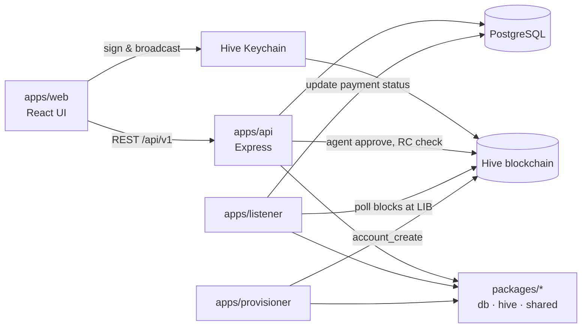

# Project Folder & File Structure

> Created: 2026-07-17 · Hive Freelance monorepo — what lives where and why.

The project is an **npm workspaces monorepo**: runnable programs live in `apps/`, shared code lives in `packages/`, and documentation lives in `Docs/`.

## High-level map

```text
hive-freelance/
├── apps/                  Runnable programs (web, api, listener, provisioner)
├── packages/              Shared libraries used by the apps
├── Docs/                  Project documentation
├── docker-compose.yml     Local PostgreSQL container
├── render.yaml            Deployment config (Render)
├── package.json           Monorepo root — workspaces + npm run dev
├── tsconfig.base.json     Shared TypeScript settings
├── .env / .env.example    Environment variables (flags, DB URL, Hive node)
└── README.md              Quick start
```

---

## apps/ — the four programs

### apps/web — React frontend (Vite, port 5173)

What the user sees in the browser. Talks to the API through the Vite proxy and to Hive Keychain for signing.

```text
apps/web/
├── index.html                  Page shell Vite injects the app into
├── vite.config.ts              Dev server + /api proxy to the API
└── src/
    ├── main.tsx                Entry point — mounts React + router
    ├── App.tsx                 Top bar navigation + route table
    ├── api.ts                  apiFetch() helper (cookies, JSON, errors)
    ├── styles.css              All styling (panels, buttons, notices)
    ├── vite-env.d.ts           Types for env vars + window.hive_keychain
    ├── lib/
    │   └── keychain.ts         Keychain Active-key broadcast helper
    └── pages/
        ├── HomePage.tsx        Health check dashboard (API + Hive status)
        ├── LoginPage.tsx       Keychain / Google / dev login + RC warning
        ├── JobsPage.tsx        Open jobs list
        ├── ContractsPage.tsx   List of your contracts
        ├── ContractPage.tsx    Escrow UI — Fund / Ratify / Release / Refund
        ├── ClaimAccountPage.tsx  Custodial → self-owned account claim
        └── KeychainCheckPage.tsx Keychain extension detection & test sign
```

### apps/api — Express REST API (port 4000)

The backend. Every route is under `/api/v1`. Layered as **routes → services → packages/db**.

```text
apps/api/
└── src/
    ├── index.ts                App wiring: middleware, routers, error handler
    ├── routes/                 HTTP endpoints (thin — validate & delegate)
    │   ├── auth.ts             Challenge/verify, Google OAuth, claim, JWT session
    │   ├── jobs.ts             Job CRUD
    │   ├── proposals.ts        Proposals + accept → creates contract
    │   ├── contracts.ts        Contracts, milestones, fund payload
    │   ├── milestones.ts       Milestone submit/approve
    │   ├── payments.ts         Escrow confirms, ratify/release/refund, custodial sign
    │   ├── users.ts            User profile endpoints
    │   ├── health.ts           /health + Hive chain health
    │   └── stubs.ts            Phase 2 placeholders (disputes, reviews → 501)
    ├── services/               Business logic (SQL + rules)
    │   ├── payments.ts         Escrow payload builder, deadlines, confirms
    │   ├── agentEscrow.ts      escrow_id hash + agent auto-approve (AGENT_LIVE)
    │   ├── contracts.ts        Contract queries, complete/cancel
    │   ├── milestones.ts       Milestone lifecycle
    │   ├── proposals.ts        Proposal lifecycle + contract creation
    │   ├── jobs.ts             Job queries
    │   ├── users.ts            User upsert / lookup
    │   ├── profiles.ts         Profile + dashboard aggregates
    │   ├── googleAuth.ts       Google OAuth exchange + custodial provisioning
    │   └── claimAccount.ts     Key handover for custodial accounts
    ├── middleware/
    │   └── auth.ts             requireAuth / requireClient / requireFreelancer
    └── lib/                    Small helpers
        ├── jwt.ts              Sign/verify JWT, hf_token cookie options
        ├── hiveAuth.ts         Keychain signature verify + RC status check
        ├── challengeStore.ts   Single-use login challenges
        ├── errors.ts           AppError + asyncHandler
        └── params.ts           Route param helper
```

#### Where do Node.js and Express live?

- **Node.js** is the runtime installed on your computer. It does not live in a project source folder. It runs the API, listener, provisioner, and development tools.
- **Express** is installed inside `node_modules/express` and declared in `apps/api/package.json`.
- The Express application starts in `apps/api/src/index.ts`.
- Express routes live in `apps/api/src/routes/`.
- Business logic called by those routes lives in `apps/api/src/services/`.

```text
Node.js
└── runs apps/api/src/index.ts
    └── Express
        ├── routes/
        └── services/
```

### apps/listener — Hive block watcher

Background process that polls the Hive blockchain and is the **source of truth** for escrow payment states (only trusts irreversible blocks — LIB).

```text
apps/listener/
└── src/
    ├── index.ts        Poll loop: fetch blocks up to LIB, store ops, cursor
    ├── filter.ts       Keep only our ops (agent account / json_meta.app match)
    └── paymentSync.ts  Apply escrow ops to DB: both-approve → escrowed,
                        release/refund at LIB, missed-ratification reset
```

### apps/provisioner — account creation stubs

Creates Hive accounts for Google users (custodial), handles RC delegation stubs. Live behavior is behind `PROVISIONER_LIVE`.

```text
apps/provisioner/
└── src/
    └── index.ts        account_create / RC delegation / custodial key storage
```

---

## packages/ — shared libraries

### packages/db — PostgreSQL access + schema

```text
packages/db/
├── migrations/
│   ├── 001_bootstrap.sql           users, oauth_accounts, hive_records, listener_state
│   ├── 002_marketplace_schema.sql  profiles, jobs, proposals, contracts,
│   │                               milestones, payments, disputes, reviews
│   └── 003_escrow_hardening.sql    approve/release tx columns, deadlines,
│                                   agent_signing_events audit table
└── src/
    ├── pool.ts         Connection pool (DATABASE_URL)
    ├── index.ts        Query helpers (hive_records upsert, listener cursor)
    ├── types.ts        Row types (UserRow, PaymentRow, ContractRow, …)
    └── migrate.ts      Migration runner (npm run migrate)
```

### packages/hive — Hive blockchain helpers

```text
packages/hive/
└── src/
    ├── chain.ts            createChain(): WAX or condenser RPC fallback
    │                       (get blocks, global properties)
    ├── kms.ts              KMS signer abstraction — local stub now,
    │                       AWS/GCP KMS in production
    ├── custodialVault.ts   Local storage of custodial user keys (dev only)
    └── index.ts            Package exports
```

### packages/shared — constants

```text
packages/shared/
└── src/
    └── index.ts    APP_ID ("hive-freelance-v1"), roles, auth types,
                    tracked escrow operation names
```

---

## Docs/ — documentation

```text
Docs/
├── [01] Product_Scope_User_flow/       Product scope + user flows
├── [02] Additional Docs/               Practical guides
│   ├── [01] Dependencies.md
│   ├── [02] Implementation Roadmap.md
│   ├── [03] Design System Notes.md
│   ├── [04] Local_Development_Guide.md  How to run everything locally
│   ├── [05] Database_Guide.md           Schema explained
│   ├── [06] API_MVP_Guide.md            Endpoint reference
│   ├── [07] Auth_Guide.md               Login flows (Keychain, Google, claim)
│   └── [08] Escrow_Guide.md             Escrow states + env flags
├── [03] System_Architecture_Data_Model/ Design source documents
│   ├── [01] Tech_Stack.md
│   ├── [02] DB_Schema_and_ER_Diagram.md
│   ├── [03] Architecture_and_API.md
│   ├── [04] Auth_Roles_Strategy.md
│   └── [05] Escrow_Integration.md
└── [04] Project Architecture/           This folder — structure explanations
```

---

## How the pieces talk to each other



**Rule of thumb when looking for code:**

- Something the user *sees* → `apps/web/src/pages/`
- An *endpoint* → `apps/api/src/routes/` (logic in `apps/api/src/services/`)
- A *payment status change from the blockchain* → `apps/listener/src/paymentSync.ts`
- A *table or column* → `packages/db/migrations/`
- A *Hive chain call or signing* → `packages/hive/src/`
